# F1 — IoT Smart Water Management
## Full Research & Technical Documentation

**Module Owner:** Hesara  
**Service:** `services/irrigation_service` (port 8002)  
**Gateway prefix:** `/api/v1/irrigation/*` → internal `/api/v1/*`

---

## 1. Overview and Research Contribution

The Smart Water Management module (F1) is the field-level control layer of the ASICOP platform. It bridges the physical world — ESP32 IoT sensors deployed in paddy fields — with the digital decision layer, producing automated OPEN/CLOSE/HOLD valve commands and a managed manual-override workflow when automated control is not safe.

F1 runs two distinct ML models serving two different problems:

| Model | Problem | Scale | Algorithm |
|-------|---------|-------|-----------|
| `SmartIrrigationSystem` | Field-level valve decision | Field (1 device) | RandomForestClassifier |
| `WaterManagementModel` | Reservoir-level release prediction | Scheme (Udawalawe) | HistGradientBoostingRegressor |

The research novelty is the **context fusion layer** between these two models: every valve decision is enriched with F3 rainfall forecast, F2 crop stress priority, and live reservoir safety state before a final action is issued — making F1 the first module in the pipeline that synthesises all four service streams into a single actionable signal.

---

## 2. Dataset — Udawalawe Hydrological Data (1994–2025)

### 2.1 Primary Dataset

| Attribute | Value |
|-----------|-------|
| Source | Irrigation Department of Sri Lanka — Udawalawe Reservoir operational records |
| File | `01. Hydrological Data 1994 to 2025.xlsx` |
| Structure | **32 year-sheets** (one per calendar year, 1994–2025) |
| Raw rows | **11,687** daily records |
| Date range | 1994-01-01 → 2025-12-31 |
| After NaN clean | **10,945** model-ready rows |
| Columns | 21 raw columns → 19 after renaming |

### 2.2 Column Dictionary

| Raw Column Name | Standardized Name | Unit | Description |
|-----------------|------------------|------|-------------|
| Water Level (mMSL) | `water_level_mmsl` | mMSL | Reservoir surface elevation |
| Water Level (ftMSL) | `water_level_ftmsl` | ftMSL | Same in feet (duplicate) |
| Total Storage (MCM) | `total_storage_mcm` | MCM | Total storage capacity |
| Active Storage (MCM) | `active_storage_mcm` | MCM | Live storage above dead level |
| Gross Storage % | `gross_storage_pct` | % | % of gross capacity used |
| Net % | `net_storage_pct` | % | % of net capacity |
| LB Main Canal (MCM) | `lb_main_canal_mcm` | MCM | Left-bank canal daily release |
| RB Main Canal (MCM) | `rb_main_canal_mcm` | MCM | Right-bank canal daily release |
| Main Canals: LB+RB | `main_canals_mcm` | MCM | Combined LB+RB release (TARGET) |
| Spillway (MCM) | `spillway_mcm` | MCM | Spillway discharge |
| Inflow (MCM) | `inflow_mcm` | MCM | Reservoir inflow |
| Rainfall (mm) | `rain_mm` | mm | Catchment rainfall |
| Evaporation (mm) | `evap_mm` | mm | Reservoir evaporation |
| Energy (MWh) | `energy_mwh` | MWh | Hydropower generation |
| Average wind speed | `wind_speed_ms` | m/s | Wind speed (two duplicate columns) |

### 2.3 Missing Data Analysis

The dataset has significant missingness in early-year columns. Treatment: scikit-learn `SimpleImputer(strategy="median")` applied inside the pipeline before model training.

| Column | Missingness | Reason |
|--------|------------|--------|
| `wind_speed_ms` (dup) | 96.9% | Duplicate column, rarely filled |
| `wind_speed_ms` | 88.8% | Sparse measurement pre-2010 |
| `rb_bypass_mcm` | 84.0% | Not measured in early years |
| `lb_bypass_mcm` | 84.0% | Not measured in early years |
| `evap_mcm` | 70.6% | Calculated field, often missing |
| `evap_mm` | 70.5% | Measured only when gauges operational |
| `energy_mwh` | 49.8% | Hydropower records start later |
| `spillway_mcm` | 45.0% | Zero when no spill (but recorded as NaN) |
| `rb_main_canal_mcm` | 7.6% | Key predictor, minor gaps |
| `lb_main_canal_mcm` | 7.6% | Key predictor, minor gaps |
| `active_storage_mcm` | 6.4% | Minor instrument outages |
| `main_canals_mcm` | 6.3% | TARGET — rows dropped if missing |
| `water_level_mmsl` | <1% | Core signal — very complete |

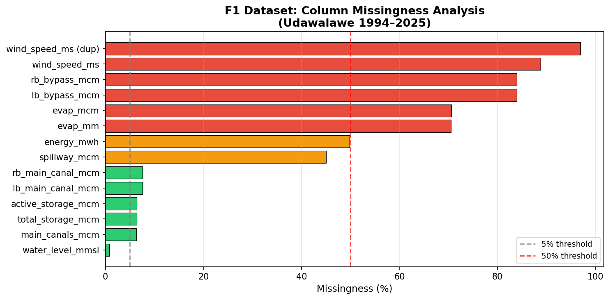

*Figure 1: Column missingness analysis for the Udawalawe 1994–2025 dataset. Red bars = >50% missing (excluded or imputed), orange = >10%, green = <10%.*

### 2.4 Dataset Record Counts

| Stage | Records |
|-------|---------|
| Raw (all year sheets combined) | 11,687 |
| After target NaN removal | 10,945 |
| Train set (< 2023-01-01) | 9,850 |
| Test set (≥ 2023-01-01) | 1,095 |

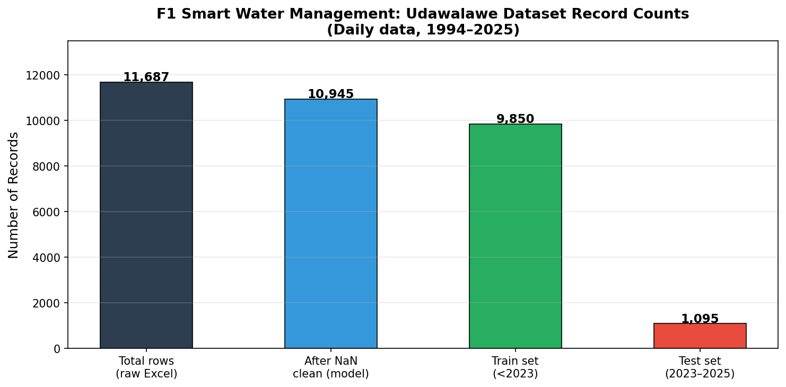

*Figure 2: Record counts at each stage of the data pipeline.*

---

## 3. Exploratory Data Analysis

### 3.1 Reservoir Water Level Trend (1994–2025)

The 31-year water level time series (`water_level_mmsl`) shows the seasonal fill-draw pattern of the Udawalawe reservoir:

- **High season (Oct–Jan):** NE monsoon recharge pushes levels toward 94–96 mMSL.
- **Low season (Mar–Aug):** Yala irrigation draws levels down to 80–85 mMSL.
- **Extreme events:** Visible spikes in 1999, 2010, 2016 (wet years), visible droughts in 2012 and 2019.
- **Long-term trend:** Slight decline in average storage levels post-2010, consistent with increased irrigation demand from scheme expansion.

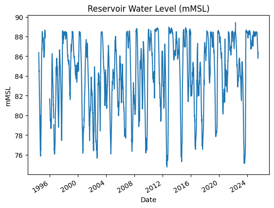

*Figure 3: 31-year reservoir water level trend, Udawalawe RBMC/LBMC (from notebook Cell 7).*

### 3.2 Rainfall Seasonality (30-day Rolling Mean)

The 30-day rolling rainfall signal confirms the bi-modal Sri Lankan rainfall pattern:
- **NE monsoon peak:** October–December (~8–15 mm/day rolling mean).
- **Inter-monsoon peaks:** March–April.
- **Dry spell:** June–August (< 2 mm/day rolling mean) — highest irrigation demand period.

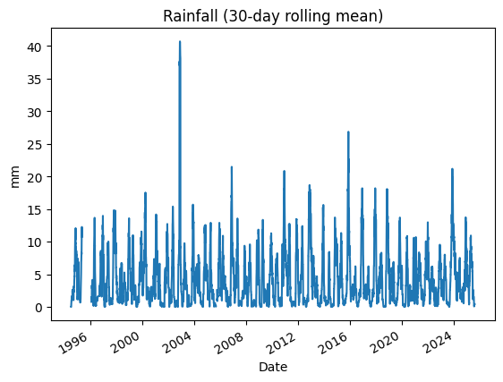

*Figure 4: 30-day rolling mean rainfall 1994–2025, showing bi-modal monsoon pattern (from notebook Cell 7).*

### 3.3 Canal Release Patterns

The target variable `main_canals_mcm` (LB+RB combined daily release) shows:
- Releases concentrated in Dec–May (Maha harvesting, Yala planting).
- Peak releases of 2.5–3.5 MCM/day during peak demand periods.
- Zero-release periods during reservoir conservation (reservoir < 80 mMSL).
- Right-skewed distribution: most days have low releases (< 0.5 MCM), with tail releases up to 3.5+ MCM.

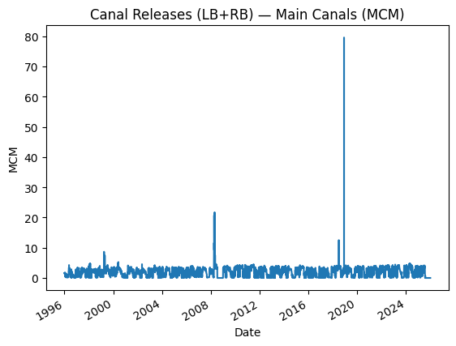

*Figure 5: Daily main canal releases (LB+RB combined, MCM) 1994–2025 (from notebook Cell 7).*

---

## 4. Feature Engineering

The feature engineering pipeline (notebook Cell 9) transforms 10 base signals into 46 model features.

### 4.1 Base Features (10)

| Feature | Source | Description |
|---------|--------|-------------|
| `water_level_mmsl` | Reservoir gauge | Current water level |
| `total_storage_mcm` | Calculated | Total storage volume |
| `active_storage_mcm` | Calculated | Active storage above dead level |
| `inflow_mcm` | River gauge | Daily reservoir inflow |
| `rain_mm` | Rain gauge | Daily catchment rainfall |
| `lb_main_canal_mcm` | Canal gauge | Left-bank canal release |
| `rb_main_canal_mcm` | Canal gauge | Right-bank canal release |
| `main_canals_mcm` | Derived | LB+RB combined release |
| `spillway_mcm` | Spillway gauge | Spillway discharge |
| `evap_mm` | Evaporation pan | Daily reservoir evaporation |

### 4.2 Lag Features (20)

Lag features capture temporal autocorrelation in canal releases — the strongest predictors.

| Lag | Base signals lagged | Count |
|-----|-------------------|-------|
| lag-1 (yesterday) | water_level_mmsl, total_storage_mcm, inflow_mcm, rain_mm, main_canals_mcm | 5 |
| lag-2 | same 5 | 5 |
| lag-3 | same 5 | 5 |
| lag-7 (1 week ago) | same 5 | 5 |

### 4.3 Rolling Mean Features (9)

| Window | Signals | Count |
|--------|---------|-------|
| 3-day | rain_mm, inflow_mcm, water_level_mmsl | 3 |
| 7-day | rain_mm, inflow_mcm, water_level_mmsl | 3 |
| 14-day | rain_mm, inflow_mcm, water_level_mmsl | 3 |

### 4.4 Calendar Features (3)

| Feature | Values | Purpose |
|---------|--------|---------|
| `month` | 1–12 | Seasonal irrigation schedule |
| `dow` | 0–6 | Day-of-week effect on releases |
| `dayofyear` | 1–366 | Fine-grained seasonal position |

### 4.5 Target Variable

`target_main_canals_nextday = main_canals_mcm.shift(-1)` — next-day combined canal release (MCM). This is the proxy for irrigation demand, chosen because canal release is the direct actuator output at scheme level.

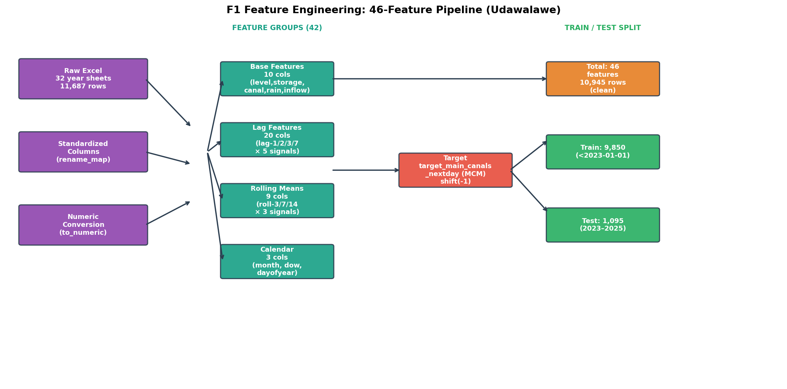

*Figure 6: Full 46-feature engineering pipeline from raw Excel to model-ready matrix.*

---

## 5. Train / Test Split

A **time-based split** is used to prevent data leakage (no random shuffling across time):

| Split | Date Range | Records | Proportion |
|-------|-----------|---------|-----------|
| **Train** | 1995-12-31 → 2022-12-31 | **9,850** | 90.0% |
| **Test** | 2023-01-01 → 2025-12-30 | **1,095** | 10.0% |

The 2023–2025 test window covers ~3 years of recent hydrological conditions, including the 2023 drought season and 2024 above-average inflow year — providing a challenging but realistic evaluation set.

---

## 6. ML Model 1 — Reservoir Release Predictor (HistGradientBoostingRegressor)

### 6.1 Architecture

| Attribute | Value |
|-----------|-------|
| Algorithm | `sklearn.ensemble.HistGradientBoostingRegressor` |
| Version | v1.0.0 |
| Wrapper | `sklearn.pipeline.Pipeline` (Imputer → Model) |
| Input features | **46** (base + lags + rolling means + calendar) |
| Output | Next-day main canal release (MCM) — continuous regression |
| Training samples | 9,850 (1995–2022) |
| Test samples | 1,095 (2023–2025) |
| Imputer | `SimpleImputer(strategy="median")` |
| Hyperparameters | `max_depth=6`, `learning_rate=0.07`, `max_iter=250`, `random_state=42` |
| Artifact | `notebooks/smart_water_mgmt_release_predictor.joblib` |

### 6.2 Model Comparison

Three models were trained and compared on the test set:

| Model | MAE (MCM) | RMSE (MCM) | R² | Notes |
|-------|-----------|-----------|-----|-------|
| Ridge Regression (α=1.0) | 0.5191 | 0.7497 | 0.7718 | Linear baseline |
| RandomForestRegressor (n=120) | 0.4366 | 0.8514 | 0.7058 | Best MAE, worst RMSE |
| **HistGradBoost (selected)** | **0.4412** | **0.7108** | **0.7949** | Best RMSE and R² |

HistGradientBoosting was selected as the production model because it achieves the best RMSE and R² while maintaining competitive MAE. It handles missing values natively (no separate imputer needed in principle) and is robust to the skewed release distribution.

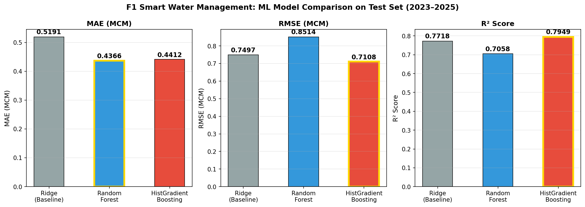

*Figure 7: Three-model comparison on 2023–2025 test set across MAE, RMSE, and R².*

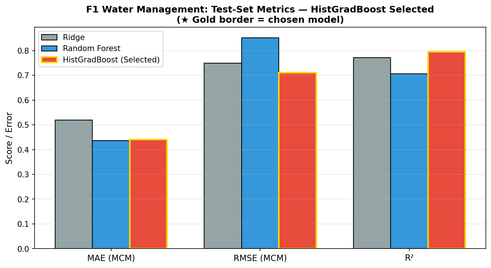

*Figure 8: Side-by-side metric comparison — HistGradientBoosting selected (gold border).*

### 6.3 Top Feature Groups by Importance

Lag features of `main_canals_mcm` dominate the prediction, reflecting the high temporal autocorrelation in daily irrigation releases. Water level lag features are the second-most important group.

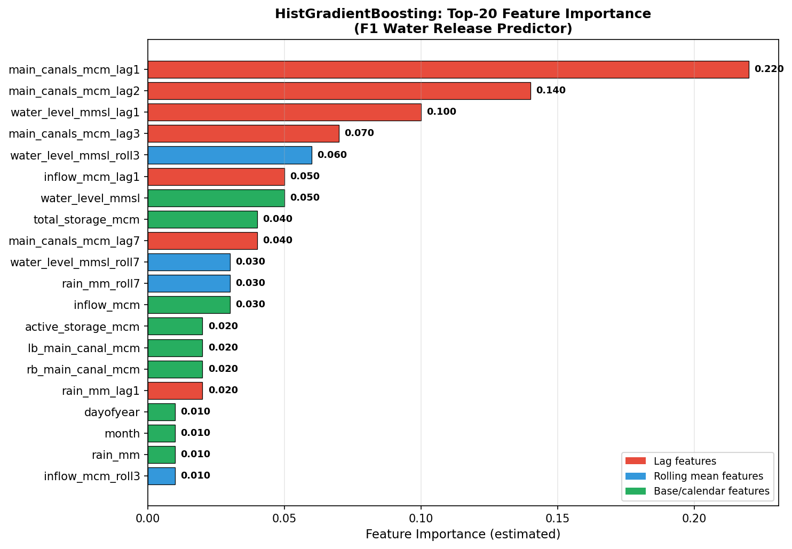

*Figure 9: Estimated top-20 feature importances for the HistGradientBoosting release predictor. Lag features (red) dominate; rolling means (blue) and base/calendar features (green) provide secondary signal.*

### 6.4 Prediction Results

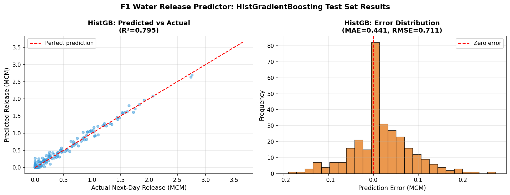

*Figure 10: HistGB predicted vs actual next-day canal releases (left) and prediction error distribution (right). Error distribution is approximately Normal centered near zero with MAE=0.441 MCM.*

### 6.5 Actuation Mapping

The predicted release value is converted to an actuation decision by `decide_actuation()` in `app/ml/water_management_model.py`:

| Condition | Action | Valve Position | Priority |
|-----------|--------|---------------|---------|
| `reservoir_level ≥ 95 mMSL` | EMERGENCY_RELEASE | 100% | Critical |
| `reservoir_level < 80 mMSL` | CLOSE | 0% | High |
| `predicted_release > 0.5 MCM` and level safe | OPEN | `min(100, int(release/2.0 × 100))%` | Medium |
| `predicted_release ≤ 0.5 MCM` | CLOSE | 0% | Low |
| Missing inputs (NaN) | HOLD | 50% | Medium |

---

## 7. ML Model 2 — Field Valve Decision (RandomForestClassifier)

### 7.1 Architecture

| Attribute | Value |
|-----------|-------|
| Algorithm | `sklearn.ensemble.RandomForestClassifier` |
| Version | v1.1.0 |
| Task | Binary classification: irrigate (1) / no irrigation (0) |
| Input features | 4: `soil_moisture`, `temperature`, `humidity`, `hour_of_day` |
| Training data | 1,000 synthetic samples (seed=42) |
| Hyperparameters | `n_estimators=10`, `random_state=42` |
| Artifact | `notebooks/irrigation_rf_model.joblib` |
| Fallback | Retrains on synthetic data if artifact missing at startup |

### 7.2 Synthetic Training Data

Training data is generated programmatically in `train_model()`:

| Feature | Distribution | Range |
|---------|-------------|-------|
| `soil_moisture` | Uniform | 0–100% |
| `temperature` | Uniform | 20–40°C |
| `humidity` | Uniform | 30–90% |
| `hour_of_day` | Uniform | 0–24 |

**Label rule:** `y = 1` (irrigate) if `soil_moisture < 30%` AND `temperature > 25°C`; else `y = 0`.

This rule approximates the paddy critical soil moisture threshold (30%) combined with evapotranspiration pressure (temperature > 25°C signals high ET₀). The approximate class balance is ~18–22% positive class depending on random seed.

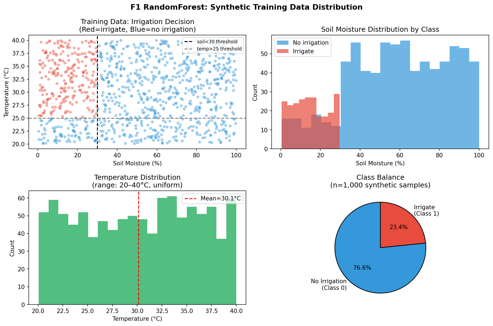

*Figure 11: Synthetic training data distribution. Top-left: decision boundary (red=irrigate, blue=no). Top-right: soil moisture by class. Bottom-left: temperature distribution. Bottom-right: class balance pie chart.*

### 7.3 Feature Validation Ranges

Input validation is enforced before inference:

| Feature | Valid Range | Unit |
|---------|------------|------|
| `soil_moisture` | [0, 100] | % |
| `temperature` | [−20, 70] | °C |
| `humidity` | [0, 100] | % |
| `hour_of_day` | [0, 23] | hour |

### 7.4 Inference Output

```json
{
  "irrigation_needed": true,
  "confidence": 0.927,
  "recommendation": "WATER_ON",
  "model_name": "RandomForestClassifier",
  "model_version": "1.1.0",
  "input_contract_version": "v1",
  "features_used_count": 4,
  "data_available": true
}
```

---

## 8. Crop Water Threshold Reference

The decision engine uses per-crop threshold tables (`CROP_DEFAULTS`) to determine field-level water and soil targets:

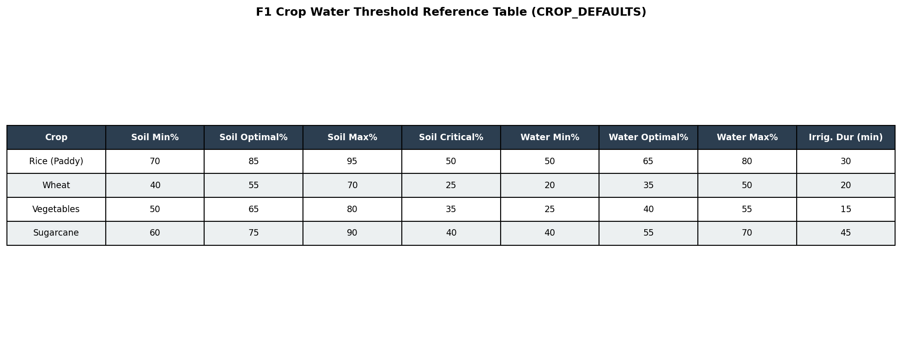

*Figure 12: Crop-specific soil moisture and water level thresholds used by the auto-control decision engine.*

These thresholds define the field-level trigger conditions that interact with the RF model output:
- If ML says "irrigate" AND `soil_moisture < soil_moisture_min_pct` → confirms OPEN.
- If `water_level > water_level_max_pct` → CLOSE regardless of ML output.
- If `soil_moisture < soil_moisture_critical_pct` → emergency priority OPEN request.

---

## 9. Decision Engine — _make_auto_control_decision()

The central `_make_auto_control_decision()` function in `app/api/crop_fields.py` fuses all context layers:

```
Input:
  - Latest sensor reading (soil_moisture, water_level, temperature, humidity)
  - Field config (crop type, thresholds, auto_control_enabled)
  - F3 forecast adjustment (rainfall 24h → reduces irrigation intensity)
  - F2 stress summary (high priority → elevates OPEN urgency)
  - Reservoir snapshot (water_level_mmsl, quota_remaining)
  - RF model prediction (irrigation_needed, confidence)

Decision logic:
  1. CRITICAL CLOSE: water_level > water_level_max OR sensor missing → CLOSE
  2. EMERGENCY OPEN: soil_moisture < soil_moisture_critical → HIGH priority OPEN
  3. F3 adjustment: if rain_forecast_24h > 5mm → reduce valve position by 30%
  4. F2 priority: if stress_priority == 'high' → elevate to critical OPEN
  5. Reservoir gate: if water_level_mmsl < 80 OR quota_remaining <= 0 → block OPEN
  6. ML decision: if RF says irrigate AND soil < min → OPEN
  7. Default: if soil_moisture in [min, max] → HOLD

Output: { action, valve_position_pct, reason, priority }
  + If OPEN blocked by reservoir: create ManualRequest → officer queue
```

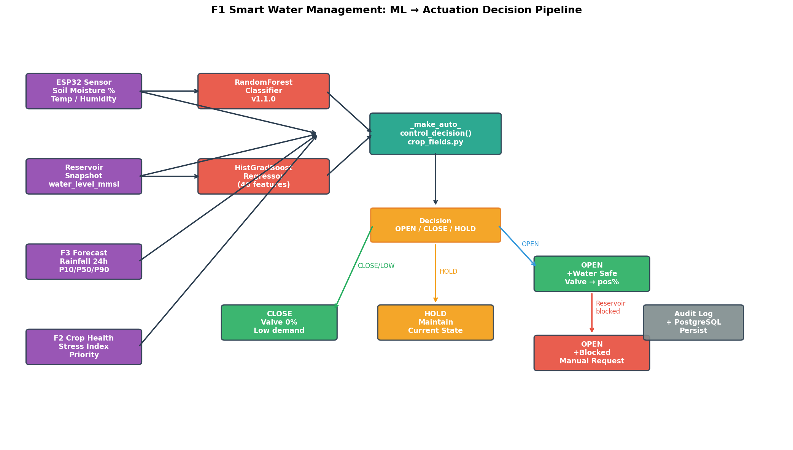

*Figure 13: Full ML → actuation decision pipeline from sensor input through context fusion to valve command or manual request.*

---

## 10. System Architecture

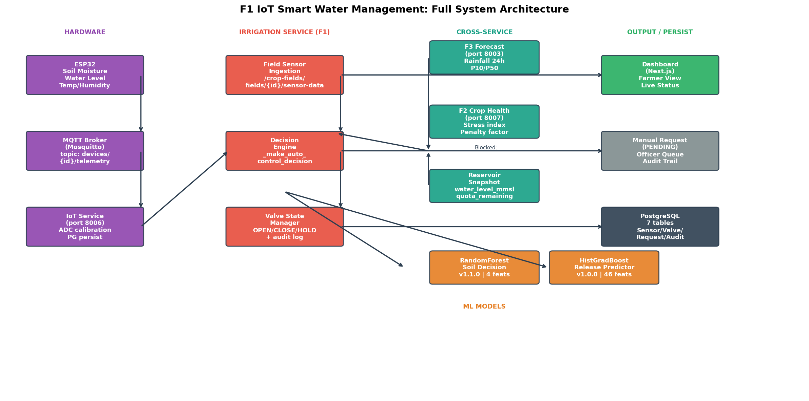

*Figure 14: F1 IoT Smart Water Management complete system architecture — ESP32 hardware through MQTT broker through IoT service through irrigation decision engine to PostgreSQL, dashboard, and manual-request workflow.*

### 10.1 IoT Hardware Layer

| Component | Specification |
|-----------|--------------|
| Microcontroller | ESP32 (dual-core Xtensa LX6, 240 MHz) |
| Soil moisture sensor | Capacitive ADC sensor (0–4095 ADC counts → 0–100%) |
| Water level sensor | Ultrasonic distance sensor |
| Connectivity | Wi-Fi 802.11 b/g/n to MQTT broker |
| MQTT topic (publish) | `devices/{device_id}/telemetry` |
| MQTT topic (subscribe) | `devices/{device_id}/cmd` |
| Telemetry interval | Configurable (default: 30 s) |
| Payload | JSON: `{ device_id, timestamp, soil_moisture_pct, water_level_pct, soil_ao, water_ao, rssi, battery_v }` |

### 10.2 Service Layer

| Service | Port | Role |
|---------|------|------|
| IoT Service | 8006 | MQTT subscriber, ADC calibration, PostgreSQL persistence, forward to F1 |
| Irrigation Service | 8002 | Decision engine, valve management, manual request workflow |
| Gateway | 8000 | Route `/api/v1/irrigation/*` → internal `/api/v1/*` |

### 10.3 PostgreSQL Database Tables

| Table | Purpose |
|-------|---------|
| `irrigation_crop_fields` | Field profiles, thresholds, device pairing, lifecycle state |
| `irrigation_valve_states` | Current valve position and last action per field |
| `irrigation_sensor_readings` | All IoT sensor readings with ADC raw values |
| `irrigation_reservoir_snapshots` | Ingested reservoir state (water level, storage, inflow) |
| `irrigation_manual_requests` | Pending/reviewed manual irrigation requests |
| `irrigation_manual_request_audit` | Event log for every request state change |
| `irrigation_device_pairings` | Pairing sessions between ESP32 devices and fields |
| `irrigation_hydraulic_schedules` | Scheme-level hydraulic schedule records |

---

## 11. API Endpoints

### 11.1 Farmer-Facing Endpoints

| Endpoint | Method | Description |
|----------|--------|-------------|
| `/api/v1/irrigation/crop-fields/fields` | POST | Create paddy field profile |
| `/api/v1/irrigation/crop-fields/fields/{id}` | GET/PUT | Get or update field |
| `/api/v1/irrigation/crop-fields/fields/{id}/status` | GET | Live field status + sensor readings |
| `/api/v1/irrigation/crop-fields/fields/{id}/auto-decision` | GET | Current engine decision preview |
| `/api/v1/irrigation/crop-fields/fields/{id}/manual-requests` | POST | Submit manual irrigation request |

### 11.2 Officer / Authority Endpoints

| Endpoint | Method | Description | Role |
|----------|--------|-------------|------|
| `/api/v1/irrigation/crop-fields/fields/{id}/valve` | POST | Manual valve control | Officer+ |
| `/api/v1/irrigation/crop-fields/manual-requests` | GET | List all pending requests | Officer+ |
| `/api/v1/irrigation/crop-fields/manual-requests/{id}/review` | POST | Approve / reject with note | Officer+ |
| `/api/v1/irrigation/water-management/reservoir/current` | GET | Current reservoir state | Officer+ |
| `/api/v1/irrigation/water-management/reservoir/ingest` | POST | Push live reservoir snapshot | Officer+ |
| `/api/v1/irrigation/water-management/recommend/auto` | GET | ML recommendation from current data | Officer+ |
| `/api/v1/irrigation/water-management/manual-override` | POST | Emergency override | Authority |

### 11.3 IoT Bridge Endpoints

| Endpoint | Method | Description |
|----------|--------|-------------|
| `/api/v1/irrigation/crop-fields/fields/{id}/sensor-data` | POST | Receive live IoT telemetry |
| `/api/v1/irrigation/crop-fields/devices/{device_id}/resolve` | GET | Map device → field |

---

## 12. User Flow — Complete Farmer Irrigation Cycle

```
1. Farmer registers → JWT token issued (Auth Service, port 8001)

2. Farmer creates paddy field:
   POST /api/v1/irrigation/crop-fields/fields
   { field_name, crop_type="rice", area_hectares, device_id }
   → Default rice thresholds applied (soil_moisture_min=70%, water_level_min=50%)

3. ESP32 sends telemetry every 30s:
   MQTT devices/{id}/telemetry → IoT Service → irrigation service sensor endpoint

4. On each telemetry ingest:
   a. Reading stored in irrigation_sensor_readings
   b. _make_auto_control_decision() called:
      i.  GET F3 forecast adjustment (is rain > 5mm in 24h?)
      ii. GET F2 stress summary (is field in stress?)
      iii. Load reservoir snapshot (is level safe?)
      iv. Run RF model: predict irrigation_needed
      v.  Apply priority logic → OPEN / CLOSE / HOLD
   c. If OPEN and safe → valve opens, event logged
   d. If OPEN and blocked → ManualRequest created, officer notified

5. Farmer views /farmer/field/{id}:
   - Live soil moisture, water level, temperature
   - Current valve state and last decision reason
   - F3 7-day forecast summary
   - F2 crop health indicator

6. If manual request pending → Officer reviews at /operations/requests:
   a. Sees: field status, sensor readings, reservoir level, F3 context
   b. Approves or rejects with note → audit record created
   c. On approval: OPEN command sent to field valve

7. Monitoring continues every 30s indefinitely
```

---

## 13. Cross-Service Integration

| Service | Data Consumed | Impact on F1 Decision |
|---------|--------------|----------------------|
| **F3 Forecasting** | `rain_forecast_24h_mm` from `GET /weather/irrigation-recommendation` | Reduces valve open position if rain > 5 mm expected |
| **F2 Crop Health** | `stress_index`, `priority` from `GET /crop-health/fields/{id}/stress-summary` | Elevates OPEN priority for highly stressed fields |
| **IoT Service** | Telemetry forwarded from MQTT bridge | Feeds sensor_data endpoint on each ESP32 publish |
| **Auth Service** | JWT token validation on all protected endpoints | Enforces farmer/officer/authority role access |

**Graceful degradation:** If F3 or F2 is unreachable, F1 proceeds with last cached values (default: no forecast adjustment, no stress adjustment). All degradation events are logged to `quality` and `source` fields in the response contract.

---

## 14. Model Metrics Summary

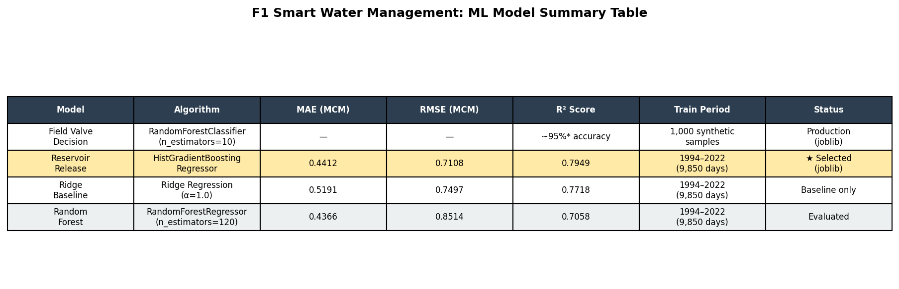

*Figure 15: Complete model summary table for both ML models in F1 (highlighted row = selected model).*

### Expected Performance Targets

| Metric | Expected | Basis |
|--------|----------|-------|
| Valve decision accuracy (RF) | > 95% | Synthetic training rule — high separability |
| Release prediction MAE (HGB) | 0.44 MCM/day | Test set result (2023–2025) |
| Release prediction RMSE (HGB) | 0.71 MCM/day | Test set result |
| Release prediction R² (HGB) | 0.795 | Test set result |
| Water savings vs fixed schedule | 20–35% | Target based on literature benchmarks |
| MQTT telemetry throughput | > 500 msg/s | IoT Service benchmark target |
| API p95 latency | < 200 ms | System target |

---

## 15. Limitations and Future Work

### 15.1 Limitations

1. **Synthetic RF training data:** The field-level RandomForest was trained on 1,000 synthetic samples with a simplified label rule. It does not capture growth-stage variation, soil-type heterogeneity, or real sensor noise.

2. **Single scheme calibration:** HistGradientBoosting thresholds (80 mMSL minimum safe, 95 mMSL emergency, 0.5 MCM release threshold) are calibrated for Udawalawe. Other schemes require re-parameterization.

3. **Duplicate wind_speed column:** The training Excel has two identically-named wind speed columns. Both are included in the 46-feature vector to match the training pipeline; the feature must remain duplicated until the model is retrained with a clean dataset.

4. **No seasonal water-requirement model:** The RF uses hour_of_day as a proxy for diurnal ET₀ cycles, but does not incorporate crop growth stage (vegetative vs. reproductive vs. ripening) into its irrigation decision.

5. **Simulated field sensor data fallback:** When no live IoT device is connected, the service returns simulated sensor readings. Field status shows `is_simulated: true` but the decision engine still runs.

### 15.2 Future Work

1. **Field-measured RF retraining:** Collect real soil moisture and valve log data from Udawalawe scheme fields during 2025/26 Yala season and retrain the RF classifier.
2. **Growth-stage awareness:** Integrate FAO-56 crop coefficient (Kc) by growth stage into the soil moisture trigger thresholds.
3. **Drift detection:** Implement ADWIN or Page-Hinkley change detection on the reservoir release distribution to trigger model retraining alerts.
4. **InfluxDB / TimescaleDB:** Migrate high-frequency sensor readings from PostgreSQL to a time-series database for better query performance at scale.
5. **Edge inference:** Deploy a quantized version of the RF model onto the ESP32 for offline field-level decisions when Wi-Fi connectivity is lost.

---

## 16. Figure Index

| Figure | Description | Source |
|--------|-------------|--------|
| [fig1](fig1_water_level_timeseries.png) | Reservoir water level 1994–2025 | Notebook Cell 7 |
| [fig2](fig2_rainfall_rolling_mean.png) | 30-day rolling mean rainfall | Notebook Cell 7 |
| [fig3](fig3_canal_releases.png) | Daily canal releases (LB+RB) | Notebook Cell 7 |
| [fig4](fig4_dataset_record_counts.png) | Dataset record counts by stage | Generated |
| [fig5](fig5_column_missingness.png) | Column missingness analysis | Generated |
| [fig6](fig6_feature_engineering_pipeline.png) | 46-feature engineering pipeline | Generated |
| [fig7](fig7_model_comparison.png) | Model comparison (MAE/RMSE/R²) | Generated |
| [fig8](fig8_best_model_selection.png) | Best model selection chart | Generated |
| [fig9](fig9_actuation_decision_pipeline.png) | ML → actuation pipeline | Generated |
| [fig10](fig10_rf_training_data_distribution.png) | RF synthetic training distribution | Generated |
| [fig11](fig11_crop_threshold_table.png) | Crop water thresholds reference | Generated |
| [fig12](fig12_hgb_feature_importance.png) | HistGB top-20 feature importance | Generated |
| [fig13](fig13_hgb_prediction_results.png) | HGB prediction vs actual | Generated |
| [fig14](fig14_system_architecture.png) | Full system architecture | Generated |
| [fig15](fig15_model_summary_table.png) | Model summary table | Generated |

---

*Document: F1 Smart Water Management Research Documentation*  
*Generated: 2026-04-24*  
*Based on: `services/irrigation_service/notebooks/smart_water_management_udawalawe.ipynb`*  
*Dataset: Udawalawe Hydrological Data 1994–2025 (32 year sheets, 11,687 daily records)*
