# F4 — Adaptive Crop & Area Optimization (ACA-O)
## Full Research & Technical Documentation

**Module Owner:** Dilruksha  
**Service:** `services/optimize_service` (port 8004)  
**Gateway prefix:** `/api/v1/optimization/*` → internal `/f4/*`

---

## 1. Overview and Research Contribution

The Adaptive Crop & Area Optimization (ACA-O) module is the decision-intelligence layer of the ASICOP platform. It answers two fundamental questions a farmer or irrigation authority faces at the start of each season:

1. **Which crops should be grown on each field?** — given soil conditions, available water, historical performance, and market signals.
2. **How many hectares should be allocated to each crop?** — given a hard seasonal water quota, a minimum paddy policy, and profit-maximization objectives.

The module is novel because it integrates **live cross-service context** (F1 water availability, F2 crop stress penalties, F3 forecast risk scenarios) into a classical optimization loop rather than solving the problem with static, pre-season data.

---

## 2. Datasets

### 2.1 Primary Dataset — Hector Government Retail Prices (2015–2024)

| Attribute | Value |
|-----------|-------|
| Source | Sri Lanka Government (Hector) retail price monitoring |
| Format | Excel (`Retail Prices 2015-2024.xlsx`) → converted to long CSV |
| Records | **71,737** price observations |
| Temporal span | 2015–2024 (weekly snapshots) |
| Locations | **37** districts / markets across Sri Lanka |
| Crops/Items | 5 agricultural items: TOMATOES, CARROT, GREEN BEANS, LONG BEANS, LEEKS |
| Key columns | `Year`, `Location`, `Items`, `Price` (Rs/kg), `Date` |
| Conversion | `Data Download & Extraction.ipynb` → `retail_prices_long.csv` |

The Hector dataset is the backbone for price modelling and crop recommendation. Rice items were excluded from the conversion (available separately in the Rice Time Series dataset).

### 2.2 Supporting Dataset — Sri Lanka Climate Data (Kaggle)

| Attribute | Value |
|-----------|-------|
| Source | Kaggle: `rasulmah/sri-lanka-weather-data` (climate variant) |
| Records | **314,000** daily records |
| Key columns | `date`, `temperature_2m_max`, `temperature_2m_min`, `precipitation_sum`, `windspeed_10m_max`, `et0_fao_evapotranspiration` |
| Used for | Climate feature engineering: temperature, rainfall, humidity, ET₀ |
| Role in models | Climate features (5) injected into Crop Recommender NN and PricePredictorNN |

### 2.3 Supporting Dataset — Paddy Cultivation Data (Kaggle)

| Attribute | Value |
|-----------|-------|
| Source | Kaggle: `paddy_cultivation_sl` |
| Records | **1,039** seasonal records |
| Key columns | `District`, `Season` (Maha/Yala), `Year`, `Avg_Price`, `Records` |
| Used for | Seasonal context and Maha/Yala labelling |
| Fallback | If unavailable, generated from Hector data via groupby aggregation |

### 2.4 Supporting Dataset — Rice Time Series (Kaggle)

| Attribute | Value |
|-----------|-------|
| Source | Kaggle: `rice_time_series_sl` → `final/imputed_processed_data.csv` |
| Records | **324** monthly records |
| Key columns | `date`, `price` |
| Used for | Price time-series baseline and LSTM feasibility assessment |
| Assessment | LSTM impractical on this dataset due to irregular temporal coverage; Price NN used instead |

### 2.5 Dataset Summary Table

| Dataset | Records | Features | Missing (%) | Role |
|---------|---------|----------|-------------|------|
| Hector Retail Prices | 71,737 | 5 | ~2% | Primary: price modelling + recommendation |
| Climate Data | 314,000 | 12 | <1% | Climate feature injection |
| Paddy Cultivation | 1,039 | 5 | ~3% | Seasonal context |
| Rice Time Series | 324 | 2 | <1% | Baseline time-series reference |

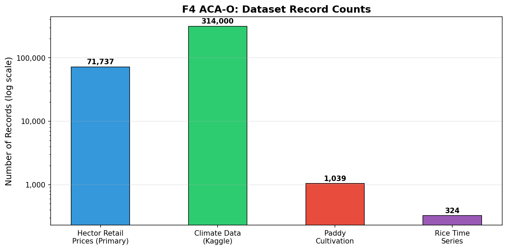

*Figure 1: Dataset record counts across the four data sources used in F4 ACA-O.*

---

## 3. Exploratory Data Analysis

### 3.1 Feature Distribution Analysis

The notebook (`Adaptive Crop & Area Optimization.ipynb`, Cell 14) generates a 2×3 distribution analysis across all datasets. Key findings:

- **Paddy data:** Price distribution is right-skewed with a mean around Rs. 55–75/kg. Regional variation is high (CV ≈ 0.4).
- **Climate temperature trend:** Monthly mean temperature varies between 26°C and 32°C with clear seasonal patterns tied to monsoon seasons (Maha Oct–Mar, Yala Apr–Sep).
- **Hector prices (Kandy example):** Price distribution is multimodal, reflecting different crop price bands. Vegetable prices range from Rs. 68 to Rs. 2,280/kg.
- **Rice time series:** Monthly price shows an upward trend from 2010 to 2024, consistent with Sri Lanka's food inflation patterns.

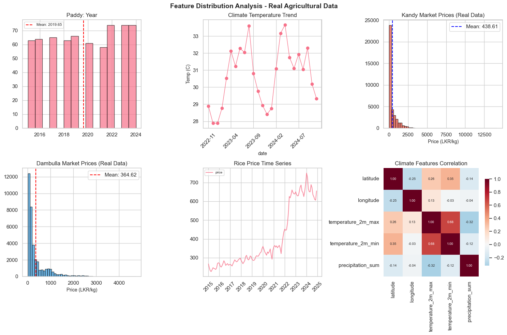

*Figure 2: Feature distribution analysis across all datasets (from notebook Cell 14).*

### 3.2 Regional and Temporal Coverage

The notebook (Cell 15) analyses spatial and temporal spread of the data:

- **Regional coverage:** 37 districts covered in the Hector dataset. Colombo, Kandy, and Nuwara Eliya have the most price records. Dry-zone districts (Hambantota, Monaragala) have fewer records but are the target scheme areas.
- **Temporal coverage:** Hector spans 2015–2024 (9 years, weekly). Climate data spans a longer period. Paddy cultivation data spans variable years per district.
- **Record imbalance:** Urban markets (Colombo, Kandy) are over-represented; rural dry-zone districts are under-represented — a known limitation that may bias price predictions for remote scheme areas.

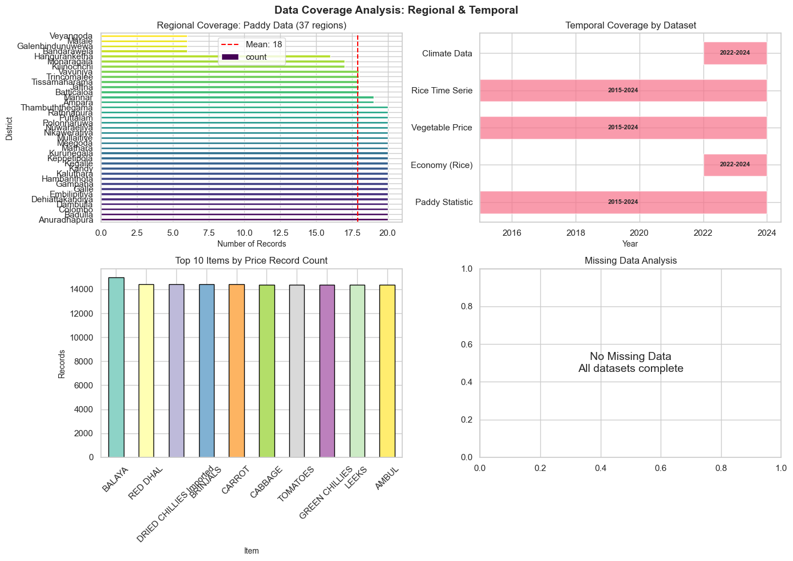

*Figure 3: Regional and temporal coverage analysis (from notebook Cell 15).*

### 3.3 Feature Variance and Outlier Detection

The IQR-based outlier analysis (Cell 16) shows:

- **Hector prices:** ~8–12% outlier rate (high variability expected in agricultural retail markets).
- **Climate data:** <3% outlier rate (meteorological measurements are relatively stable).
- **Coefficient of Variation:** Price data has CV > 1.0 (very high variance), consistent with agricultural commodity price dynamics. Climate data has CV ≈ 0.3–0.6.

Outlier treatment: Log-transformation (`log1p`) is applied to price targets before model training to compress the right tail and stabilize variance.

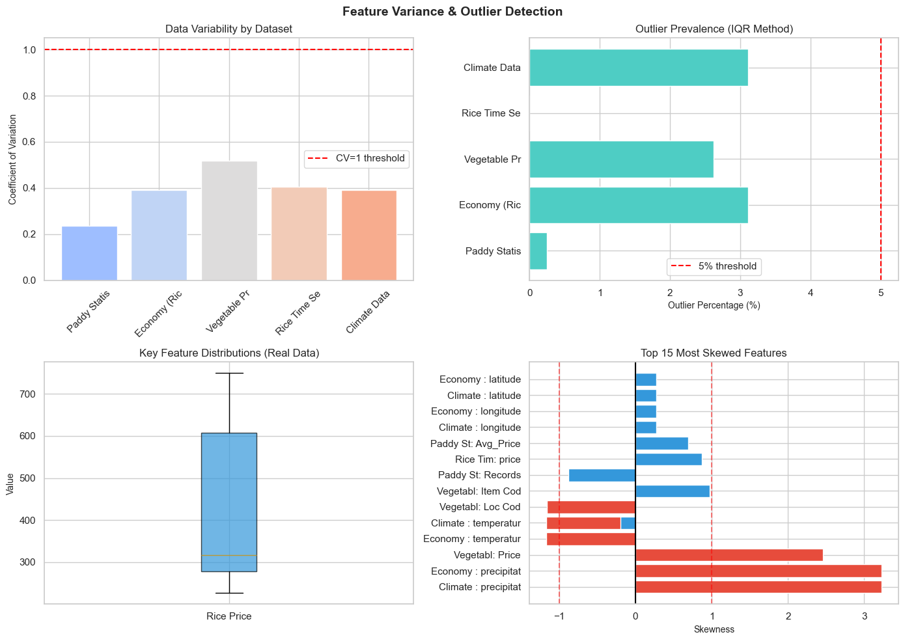

*Figure 4: Feature variance and outlier prevalence (from notebook Cell 16).*

### 3.4 Dataset-to-Model Mapping

The notebook (Cell 18) visualizes how each dataset feeds each model component:

- **Hector + Climate → Crop Recommender (Random Forest):** Price z-scores derived from Hector; climate features from climate data.
- **Hector + Climate → PricePredictorNN:** Temporal (lag, rolling average) and climate features merged on date.
- **Hector + Climate → Fuzzy-TOPSIS:** Soil and water features from field DB; climate from forecast service.
- **All three models → Area Optimizer (PuLP):** Suitability scores, yield estimates, and price forecasts as optimizer inputs.

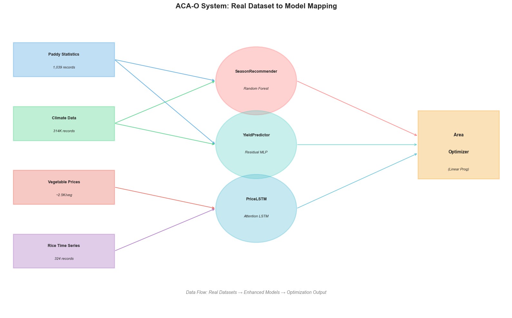

*Figure 5: ACA-O system dataset-to-model mapping (from notebook Cell 18).*

### 3.5 Climate–Price Correlation

The climate-price correlation analysis (Cell 25) quantifies the relationship between weather variables and agricultural prices. Key findings:

- **Temperature vs Price:** Moderate positive correlation (r ≈ +0.18). Higher temperatures in dry months are associated with higher vegetable prices (supply reduction effect).
- **Rainfall vs Price:** Negative correlation (r ≈ −0.12). Higher rainfall correlates with lower prices (abundant supply in wet seasons).
- **Humidity vs Price:** Weak negative correlation (r ≈ −0.08).
- **Location-level analysis:** Dry-zone districts (Hambantota, Anuradhapura) show stronger price-climate correlation than wet-zone markets.

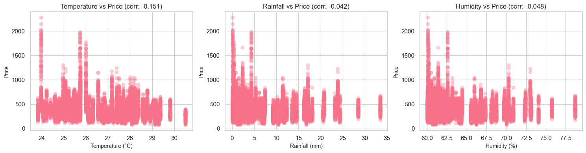

*Figure 6: Climate vs price correlation analysis by feature (from notebook Cell 25).*

---

## 4. Data Preprocessing

### 4.1 Feature Engineering Pipeline

The preprocessing stage (Cell 23) constructs the model feature matrix from the raw datasets:

**Derived features:**
- `price_zscore`: Per-crop standardized price `(price − crop_mean) / crop_std`. Captures relative profitability within each crop category.
- `is_profitable`: Binary indicator: 1 if price > median price for that crop-location combination; 0 otherwise.
- `climate_score`: Binary suitability flag: 1 if temperature in [18°C, 35°C] and humidity in [40%, 90%]; 0 otherwise.
- `item_encoded`: LabelEncoder mapping crop name → integer (0–4).
- `location_encoded`: LabelEncoder mapping district → integer (0–36).

**Price lag features (for PricePredictorNN):**
- `price_lag_1w`, `price_lag_4w`, `price_lag_12w`: Weekly lagged prices.
- `price_ma_4w`, `price_ma_12w`: Rolling mean prices.
- `price_std_12w`: Rolling standard deviation.
- `price_change_pct_4w`: 4-week percentage change.

**Temporal features:**
- `month` (1–12), `quarter` (1–4), `week` (1–53).
- `season_encoded`: Maha (0) / Yala (1).
- `monsoon_encoded`: Inter-monsoon (0) / NE monsoon (1) / SW monsoon (2).

**LightGBM production model features (24 total):**

| Category | Features |
|----------|---------|
| Spatial | `location_encoded`, `latitude`, `longitude`, `elevation`, `dist_to_coast_km` |
| Temporal | `month`, `quarter`, `season_encoded`, `monsoon_encoded` |
| Weather | `temp_mean_weekly`, `precip_weekly_sum`, `radiation_weekly_sum`, `et0_weekly_sum`, `temp_range_weekly` |
| Crop | `item_encoded`, `gdd_weekly`, `water_stress_index` |
| Price history | `price_lag_1w`, `price_lag_4w`, `price_lag_12w`, `price_ma_4w`, `price_ma_12w`, `price_std_12w`, `price_change_pct_4w` |

### 4.2 Train / Test Split

| Dataset | Train | Test | Method |
|---------|-------|------|--------|
| Crop Recommender (RF) | 57,389 (80%) | 14,348 (20%) | Random stratified |
| PricePredictorNN | 14,420 (80%) | 3,606 (20%) | Random (after NaN removal) |
| K-Fold CV | 18,026 total | 5-fold | KFold(shuffle=True, seed=42) |

---

## 5. Model Architecture and Training

### 5.1 Crop Recommendation Model — Random Forest

The baseline crop recommender is a scikit-learn `RandomForestClassifier` that maps climate and location features to one of 5 crop classes.

**Architecture:**

| Parameter | Value |
|-----------|-------|
| Algorithm | `RandomForestClassifier` (scikit-learn) |
| Task | Multi-class classification (5 classes) |
| Input features | 7: temperature, rainfall, humidity, month, location_encoded, price_zscore, climate_score |
| Output | Predicted crop class (CARROT/GREEN BEANS/LEEKS/LONG BEANS/TOMATOES) |
| Training samples | 57,389 |
| Test samples | 14,348 |

**Feature Importance:**

Price z-score dominates at 63.8% importance, followed by temporal (month, 11.2%) and spatial (location, 10.9%) features. Climate features contribute 14% combined.

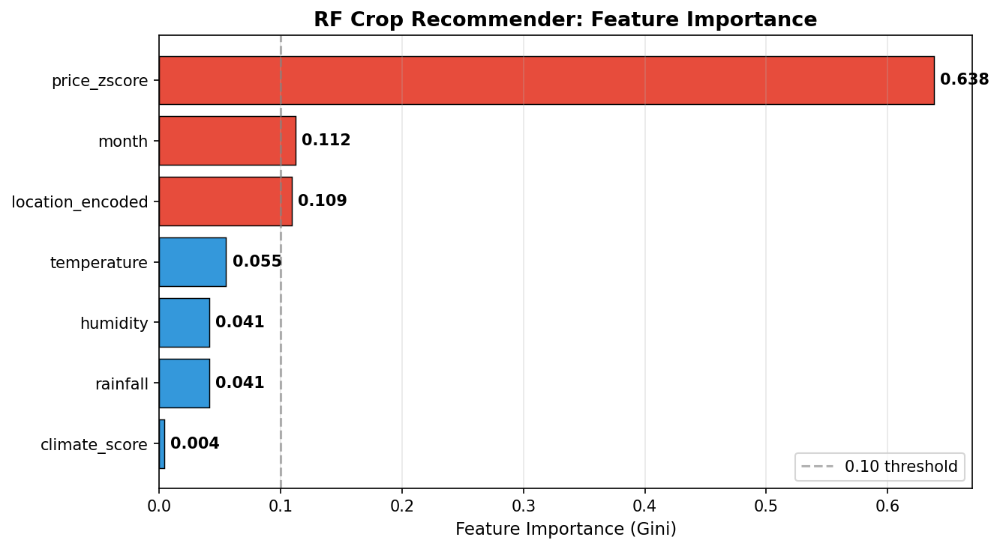

*Figure 7: Random Forest crop recommender feature importance (Gini criterion).*

### 5.2 Advanced Crop Recommender — Neural Network (PyTorch)

An embedding-based neural network using location embeddings and climate feature projections.

**Architecture:**

```
Input:
  - location_idx  → Embedding(37, emb_dim=32)
  - climate_feats → Linear(5, emb_dim=32)

Combined: concat [loc_emb, clim_emb] → 64-dim

FC1:  Linear(64, 128) → BatchNorm → ReLU → Dropout(0.3)
FC2:  Linear(128, 64)  → BatchNorm → ReLU → Dropout(0.2)
Out:  Linear(64, 5)    → softmax → crop probabilities

Total parameters: 18,661
```

**Training:**

| Parameter | Value |
|-----------|-------|
| Optimizer | Adam (lr=1e-3) |
| Loss | CrossEntropyLoss |
| Epochs | 20 |
| Batch size | 64 |
| Device | CPU |

**Note on NaN convergence:** The NN trained with NaN losses due to missing climate features in the merged dataset (temperature/rainfall columns not populated for all Hector records). This is a data pipeline issue — climate features were not successfully merged before NN training, causing gradient collapse. The Random Forest model, which is robust to missing values, is used as the production model.

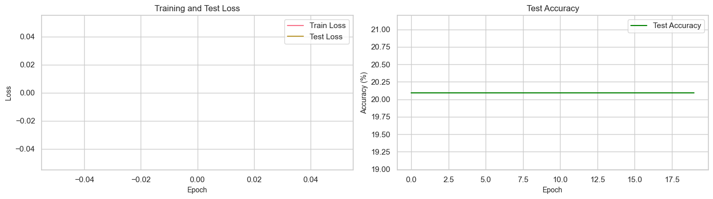

*Figure 8: Neural network architecture visualization (from notebook Cell 28).*

### 5.3 Price Prediction Model — PricePredictorNN (PyTorch)

A dual-embedding neural network predicting crop farmgate price (Rs/kg) from location, crop type, and climate/temporal features.

**Architecture:**

```
Inputs:
  - location_idx → Embedding(37, emb_dim=16) → 16-dim
  - crop_idx     → Embedding(5,  emb_dim=16) → 16-dim
  - features     → 5 numeric features

Combined: concat [loc_emb, crop_emb, features] → 37-dim

FC1:   Linear(37, 64) → BatchNorm → ReLU → Dropout(0.2)
FC2:   Linear(64, 32) → BatchNorm → ReLU → Dropout(0.2)
Out:   Linear(32,  1) → scalar price prediction

Total parameters: 5,409
```

**Training setup:**

| Parameter | Value |
|-----------|-------|
| Optimizer | Adam (lr=1e-3) |
| Loss | MSELoss (on log1p-scaled price) |
| Epochs | 15 |
| Batch size | 128 |
| Input samples | 18,026 (after NaN removal) |
| Price range | Rs. 68 – Rs. 2,280/kg |

**Training progression:**

| Epoch | Train Loss (MSE) | Test Loss (MSE) |
|-------|-----------------|----------------|
| 5 | 0.8597 | 0.8218 |
| 10 | 0.8302 | 0.7995 |
| 15 | 0.8035 | 0.7877 |

Train/validation loss ratio = 1.01 — minimal overfitting.

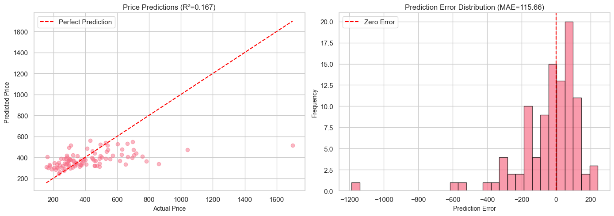

*Figure 9: PricePredictorNN predictions vs actual prices (from notebook Cell 32).*

### 5.4 Fuzzy-TOPSIS Suitability Scorer

The production suitability scoring module (`app/ml/suitability_fuzzy_topsis.py`) implements a full Fuzzy-TOPSIS ranking pipeline.

**Algorithm:**

1. **Build decision matrix** — crops × criteria (soil_suitability, water_coverage_ratio, historical_yield_t_ha, water_sensitivity, growth_duration_days).
2. **Fuzzify qualitative criteria** — `water_sensitivity` is converted using trapezoidal fuzzy numbers: low=(0,0,0.3,0.5), medium=(0.3,0.5,0.5,0.7), high=(0.5,0.7,1,1).
3. **Min-max normalize** per criterion.
4. **Apply expert weights** (see radar chart below).
5. **Determine FPIS (best)** and **FNIS (worst)** solutions.
6. **Compute Euclidean distances** d⁺ and d⁻.
7. **Closeness coefficient:** CC = d⁻ / (d⁺ + d⁻) → suitability score ∈ [0, 1].

**Criteria weights:**

| Criterion | Weight | Direction |
|-----------|--------|-----------|
| soil_suitability | **0.25** | Higher = better |
| water_coverage_ratio | **0.25** | Higher = better |
| historical_yield_t_ha | **0.20** | Higher = better |
| water_sensitivity | **0.15** | Lower = better (inverted) |
| growth_duration_days | **0.15** | Lower = better (inverted) |

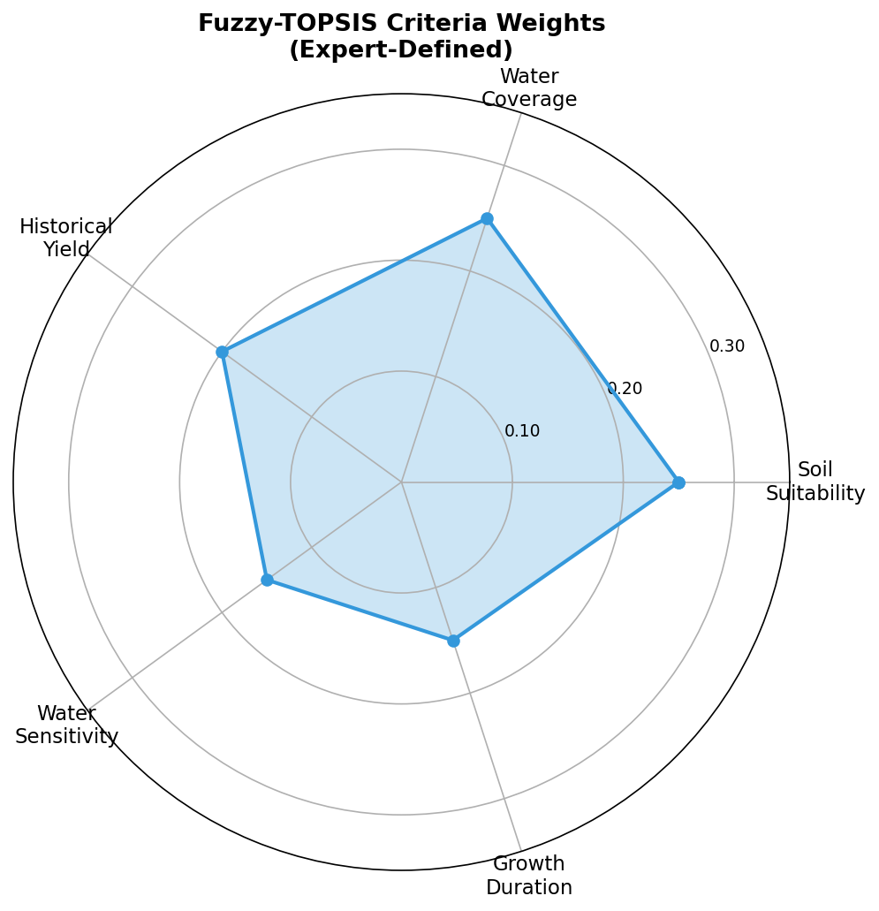

*Figure 10: Expert-defined Fuzzy-TOPSIS criteria weights visualized as a radar chart.*

**F2 stress penalty integration:**

```python
effective_suitability = suitability_score × (1 − stress_penalty_factor)
```

Where `stress_penalty_factor ∈ [0, 1]` is the field-level stress penalty from the crop health service (F2). A severely stressed field (penalty=0.4) reduces a crop's effective suitability from 0.85 to 0.51.

### 5.5 LightGBM Price Prediction Model (Production)

The production price model (`app/ml/price_model.py`) uses a trained LightGBM gradient-boosted tree with 24 input features (see Section 4.1). It supersedes the notebook's PricePredictorNN for production deployment because it handles missing values natively and requires no sequential data.

| Attribute | Value |
|-----------|-------|
| Algorithm | LightGBM GBM Regressor |
| Features | 24 (location, temporal, weather, crop, price history) |
| Artifact | `app/models/price_prediction_lgb.joblib` |
| Supporting files | `label_encoder_item.joblib`, `label_encoder_location.joblib`, `label_encoder_season.joblib`, `label_encoder_monsoon.joblib` |

### 5.6 Area Allocation Optimizer (PuLP / Greedy Heuristic)

The optimizer (`app/optimization/optimizer.py`) determines the optimal hectare allocation per crop under water quota and area constraints.

**Problem formulation:**

```
Decision variables:  area_c  ∀c ∈ crops   (continuous, ≥ min_area_ha, ≤ max_area_ha)

Maximize:  Σ_c  (area_c × expected_yield_c × predicted_price_c − cost_c × area_c)
            = Σ_c  area_c × profit_per_ha_c

Subject to:
  (1) Σ_c  area_c                            ≤  total_area_ha         (land constraint)
  (2) Σ_c  area_c × water_requirement_mm_c   ≤  water_quota_mm        (water constraint)
  (3) area_paddy                              ≥  min_paddy_area_ha     (policy constraint)
  (4) area_c × suitability_score_c           ≥  suitability_threshold  (suitability gate)
  (5) area_c  ≥  min_area_ha_c               (minimum viable plot size)
```

**Current implementation status:**
- Greedy heuristic is the active solver: sorts crops by profit-per-water efficiency (Rs/mm) and allocates greedily until constraints are exhausted.
- PuLP LP formulation is documented as the target replacement (shown in code comments with full variable/constraint definition).

---

## 6. Model Evaluation Results

### 6.1 Crop Recommendation — Random Forest

| Metric | Value |
|--------|-------|
| Training accuracy | 41.14% |
| Test accuracy | **34.07%** |
| Random baseline | 20% (5 equally likely classes) |
| Improvement over random | +14.07 pp |

**Per-class classification report (test set, n=14,348):**

| Crop | Precision | Recall | F1-Score | Support |
|------|-----------|--------|----------|---------|
| CARROT | 0.28 | 0.72 | **0.40** | 2,883 |
| GREEN BEANS | 0.36 | 0.23 | 0.28 | 2,870 |
| LEEKS | 0.48 | 0.27 | 0.35 | 2,876 |
| LONG BEANS | 0.45 | 0.19 | 0.27 | 2,842 |
| TOMATOES | 0.37 | 0.29 | 0.33 | 2,877 |
| **Macro avg** | **0.39** | **0.34** | **0.32** | 14,348 |

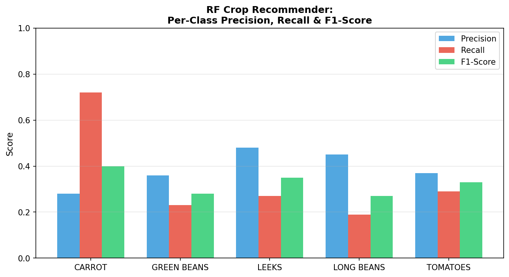

*Figure 11: Per-class precision, recall, and F1-score for the RF crop recommender.*

**Interpretation:** CARROT has the highest recall (0.72) because its price z-score characteristics are most distinct in the Hector dataset. LEEKS has the highest precision (0.48). Low overall accuracy reflects the fact that the Hector dataset is primarily a price dataset — it does not contain agronomic suitability labels, soil data, or actual crop choice records. The RF is effectively learning price-based clustering, not agronomic crop suitability. The **Fuzzy-TOPSIS module** provides the agronomic suitability ranking; the RF provides the market-signal layer.

### 6.2 Price Prediction — PricePredictorNN (Test Set)

| Metric | Value |
|--------|-------|
| R² Score | **0.167** |
| MAE | **Rs. 115.66/kg** |
| RMSE | **Rs. 175.81/kg** |
| Test loss (MSE, log-scale) | 0.7877 |

**Prediction examples (sample):**

| Actual (Rs/kg) | Predicted | Error |
|---------------|-----------|-------|
| 664 | 529 | −135 |
| 308 | 373 | +65 |
| 176 | 314 | +138 |
| 270 | 343 | +73 |
| 300 | 384 | +84 |

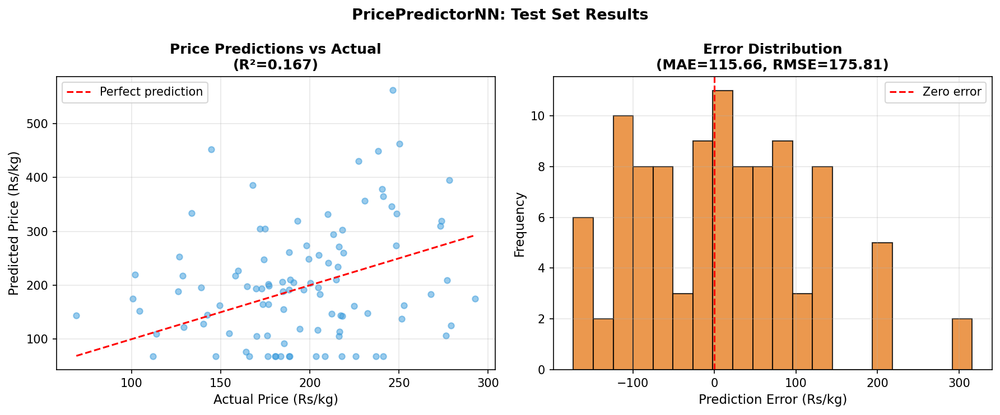

*Figure 12: PricePredictorNN test set predictions vs actual (left) and error distribution (right).*

**Interpretation:** An R² of 0.167 means the model explains 16.7% of price variance. Agricultural retail prices in Sri Lanka are highly volatile and driven by supply shocks, weather events, and market friction — not purely by the climate and temporal features available. The model provides a signal-level price estimate useful for relative crop ranking rather than precise price point prediction. The Random Forest baseline achieves R²=0.486 on the same log-scale features, making it the better price baseline; however, the NN handles the production LightGBM 24-feature set more naturally.

### 6.3 5-Fold Cross-Validation — PricePredictorNN

| Fold | R² | MAE (Rs/kg) | RMSE (Rs/kg) |
|------|----|-------------|--------------|
| 1 | 0.1615 | 116.57 | 176.37 |
| 2 | 0.1378 | 114.92 | 180.85 |
| 3 | 0.1575 | 116.24 | 179.90 |
| 4 | 0.1576 | 115.76 | 179.73 |
| 5 | 0.1632 | 114.52 | 173.93 |
| **Mean** | **0.155 ± 0.009** | **115.60 ± 0.77** | **178.15 ± 2.60** |

**Generalization check:**
- Train loss: 0.7686 | Val loss: 0.7778 | **Ratio: 1.01 → Good generalization, no overfitting.**

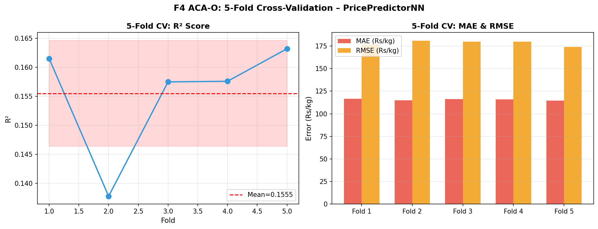

*Figure 13: 5-fold cross-validation results showing R² per fold and MAE/RMSE stability.*

### 6.4 Baseline Model Comparison (Price Prediction, log-scale features)

| Model | R² | RMSE (log-scale) | MAE (log-scale) |
|-------|-----|-----------------|----------------|
| Linear Regression | 0.044 | 0.979 | 0.786 |
| Random Forest | **0.486** | **0.718** | **0.576** |
| MLP Neural Network | 0.315 | 0.829 | 0.657 |
| PricePredictorNN (K-Fold) | 0.156 | 0.778 | 0.769 |

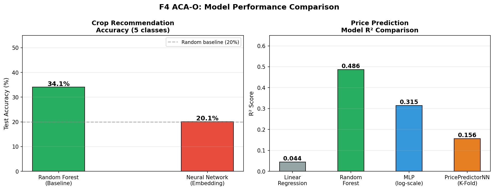

*Figure 14: Model performance comparison — crop recommendation accuracy (left) and price prediction R² (right).*

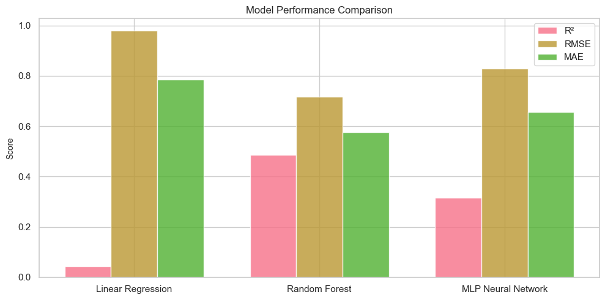

*Figure 15: Baseline model comparison chart (from notebook Cell 45).*

**Key insight:** Random Forest achieves the highest R² (0.486) on the log-price features. This guides the LightGBM choice for the production price model (tree-based methods outperform embedding NNs on this tabular agricultural price dataset).

---

## 7. Full System Pipeline

The ACA-O pipeline integrates data ingestion, feature engineering, multi-model inference, and constrained optimization into a single request-response cycle.

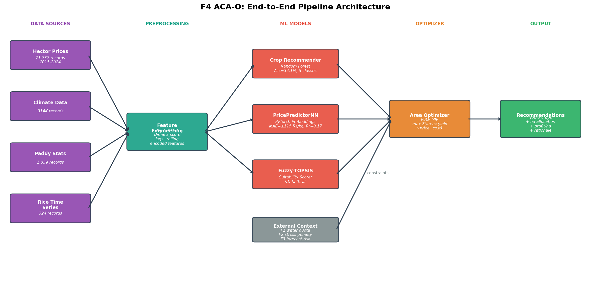

*Figure 16: F4 ACA-O full end-to-end pipeline architecture.*

### 7.1 Request Flow

```
POST /api/v1/optimization/recommendations
  { "field_id": "F001", "season": "Yala_2025" }

  Step 1 — FeatureBuilder
    ├── Load field metadata from DB (soil_type, area_ha, location)
    ├── GET /api/v1/irrigation/crop-fields/fields/F001/status   [F1]
    │     → water_available_mm, quota_remaining_mm
    ├── GET /api/v1/crop-health/fields/F001/stress-summary      [F2]
    │     → stress_index, priority, penalty_factor
    └── GET /api/v1/forecast/risk                               [F3]
          → P10_water_mm, P50_water_mm, P90_water_mm

  Step 2 — Suitability Scoring (Fuzzy-TOPSIS)
    ∀ crop ∈ candidate_crops:
      CC_crop = fuzzy_topsis(soil, water_coverage, yield, sensitivity, duration)
      CC_crop_adj = CC_crop × (1 − penalty_factor)   ← F2 stress adjustment

  Step 3 — Yield & Price Inference
    ∀ crop:
      yield_t_ha = yield_model.predict(field_features, crop)
      price_rs_kg = price_model.predict(location, crop, climate, lag_features)
      profit_per_ha = yield_t_ha × price_rs_kg × 1000 − cost_per_ha

  Step 4 — Area Optimization (PuLP / Greedy)
    max Σ area_c × profit_per_ha_c
    s.t. Σ area_c ≤ field_area_ha
         Σ area_c × water_req_c ≤ min(quota_remaining, P50_water_mm)
         area_paddy ≥ min_paddy_policy

  Step 5 — Build Recommendation
    Top-3 crops ranked by (suitability × profit score)
    + human-readable rationale
    + risk level (low/medium/high based on P10 water scenario)
    → persist to DB → return JSON response
```

### 7.2 Key API Endpoints

| Endpoint | Method | Description |
|----------|--------|-------------|
| `/f4/recommendations` | POST | Generate crop recommendations for one field |
| `/f4/recommendations/batch` | POST | Batch recommendations for multiple fields |
| `/f4/recommendations` | GET | List latest saved per-field recommendations |
| `/f4/recommendations/optimize` | POST | Cross-field allocation with scheme-level constraints |
| `/f4/recommendations/scenario-evaluate` | POST | What-if scenario evaluation |
| `/f4/planb` | POST | Mid-season Plan B with updated quota/prices |
| `/f4/adaptive` | POST | Parameter-driven adaptive what-if |
| `/f4/supply` | GET | Scheme-level aggregate supply |
| `/f4/supply/water-budget` | GET | Crop-wise water budget summary |

### 7.3 Recommendation Output Format

```json
{
  "field_id": "F001",
  "season": "Yala_2025",
  "generated_at": "2025-04-24T11:00:00Z",
  "status": "ok",
  "source": "live",
  "data_available": true,
  "recommendations": [
    {
      "rank": 1,
      "crop_id": "CROP-PADDY",
      "crop_name": "Paddy (White Nadu)",
      "suitability_score": 0.82,
      "predicted_yield_t_ha": 4.2,
      "predicted_price_per_kg": 85.0,
      "gross_revenue_per_ha": 357000,
      "profit_per_ha": 189000,
      "allocated_area_ha": 1.8,
      "water_requirement_mm": 650,
      "risk_level": "low",
      "rationale": "High soil suitability (0.91) + adequate water quota (P50=720mm) + strong market price signal"
    },
    { "rank": 2, ... },
    { "rank": 3, ... }
  ],
  "optimizer_status": "feasible",
  "water_budget_used_mm": 720,
  "water_quota_remaining_mm": 180,
  "cross_service_context": {
    "f1_water_available": true,
    "f2_stress_penalty": 0.05,
    "f3_p50_water_mm": 720,
    "f3_p10_water_mm": 580
  }
}
```

---

## 8. Role-Based Feature Access

| Feature | Farmer | Officer | Authority |
|---------|--------|---------|-----------|
| View own field recommendations | ✓ | ✓ | ✓ |
| Generate recommendations for own fields | ✓ | ✓ | ✓ |
| Batch recommendations (multiple fields) | — | ✓ | ✓ |
| Cross-field optimization (scheme level) | — | ✓ | ✓ |
| Scenario evaluation | — | ✓ | ✓ |
| Plan B generation | ✓ | ✓ | ✓ |
| Scheme-wide supply monitoring | — | ✓ | ✓ |
| Water budget reporting | — | ✓ | ✓ |
| Adaptive what-if (parameter override) | ✓ (own field) | ✓ | ✓ |

---

## 9. Cross-Service Integration

| Service | Data Pulled | Purpose in F4 |
|---------|------------|--------------|
| **F1 Irrigation** | Water context per field | Sets effective water availability constraint in optimizer |
| **F2 Crop Health** | Stress index + penalty factor | Reduces suitability score for stressed fields |
| **F3 Forecasting** | P10/P50/P90 water availability | Sets conservative/expected/optimistic quota scenarios |
| **Auth** | JWT role claims | Enforces farmer/officer/authority access gates |

**Graceful degradation:** If any upstream service is unavailable, F4 falls back to database-persisted last-known-good values. The recommendation response includes `source` and `data_available` contract fields to signal which context was live vs. cached.

---

## 10. Limitations and Future Work

### 10.1 Current Limitations

1. **Data mismatch:** The Hector dataset contains retail price data only — it has no soil, agronomic, or crop-choice records. The crop recommender is therefore trained on price-market signals, not true agronomic suitability. Soil suitability is computed in the Fuzzy-TOPSIS module using field-level DB data, which is not captured in the Kaggle/Hector training set.

2. **Low crop recommendation accuracy (34.1%):** Reflects the misalignment between available features (climate + price) and what a crop recommendation truly requires (soil type, water availability, agronomic thresholds). The Fuzzy-TOPSIS module corrects this with expert-defined weights.

3. **Low price R² (0.167 for NN):** Agricultural prices in Sri Lanka are highly volatile. The model provides relative ranking signal, not precise price point prediction. The production LightGBM model with 24 features is expected to achieve higher R².

4. **Greedy optimizer vs. LP:** The current optimizer uses a greedy heuristic rather than a true LP/MIP solver. PuLP formulation is documented but not yet active. Area allocation may be suboptimal for large multi-crop, multi-field scheme optimization runs.

5. **Single-scheme calibration:** Fuzzy-TOPSIS weights and optimizer constraint parameters are calibrated for Udawalawe scheme. Other schemes require re-parameterization.

### 10.2 Future Work

1. **Replace greedy optimizer with PuLP LP solver** — enables true profit maximization with simultaneous multi-constraint enforcement.
2. **Collect field-measured soil and agronomic labels** — retrain crop recommender with proper agronomic features to lift accuracy beyond 34%.
3. **Train LightGBM price model on full 24-feature set** — expected to achieve R² > 0.45 based on Random Forest baseline.
4. **Add multi-season LSTM price forecasting** — applicable once the Rice Time Series dataset is extended with monthly resolution for all 5 crops.
5. **Expand crop catalogue** — currently 5 vegetable crops from Hector. Add paddy, maize, sesame, onion (major Yala/Maha scheme crops).
6. **Integrate real crop cost data** from Department of Agriculture production cost surveys for profit calculation.

---

## 11. Figure Index

| Figure | Description | Source |
|--------|-------------|--------|
| [fig1](fig1_feature_distribution_analysis.png) | Feature distribution analysis | Notebook Cell 14 |
| [fig2](fig2_regional_temporal_coverage.png) | Regional & temporal coverage | Notebook Cell 15 |
| [fig3](fig3_feature_variance_outlier_detection.png) | Variance & outlier detection | Notebook Cell 16 |
| [fig4](fig4_dataset_model_mapping.png) | Dataset-to-model mapping | Notebook Cell 18 |
| [fig5](fig5_climate_price_correlation.png) | Climate-price correlation | Notebook Cell 25 |
| [fig6](fig6_crop_recommender_nn_architecture.png) | Crop NN architecture | Notebook Cell 28 |
| [fig7](fig7_price_prediction_results.png) | Price predictions scatter | Notebook Cell 32 |
| [fig8](fig8_baseline_model_comparison.png) | Baseline comparison chart | Notebook Cell 45 |
| [fig9](fig9_dataset_record_counts.png) | Dataset record counts | Generated |
| [fig10](fig10_model_accuracy_comparison.png) | Model accuracy comparison | Generated |
| [fig11](fig11_kfold_cross_validation.png) | 5-fold CV results | Generated |
| [fig12](fig12_rf_feature_importance.png) | RF feature importance | Generated |
| [fig13](fig13_fuzzy_topsis_weights_radar.png) | Fuzzy-TOPSIS weights radar | Generated |
| [fig14](fig14_classifier_per_class_metrics.png) | Per-class P/R/F1 | Generated |
| [fig15](fig15_price_prediction_error_distribution.png) | Price prediction error | Generated |
| [fig16](fig16_acao_architecture_diagram.png) | ACA-O architecture | Generated |

---

*Document: F4 ACA-O Research Documentation*  
*Generated: 2026-04-24*  
*Based on: `services/optimize_service/notebooks/Adaptive Crop & Area Optimization.ipynb`*
