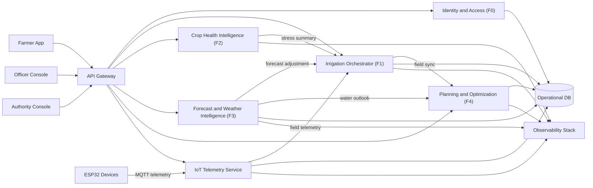
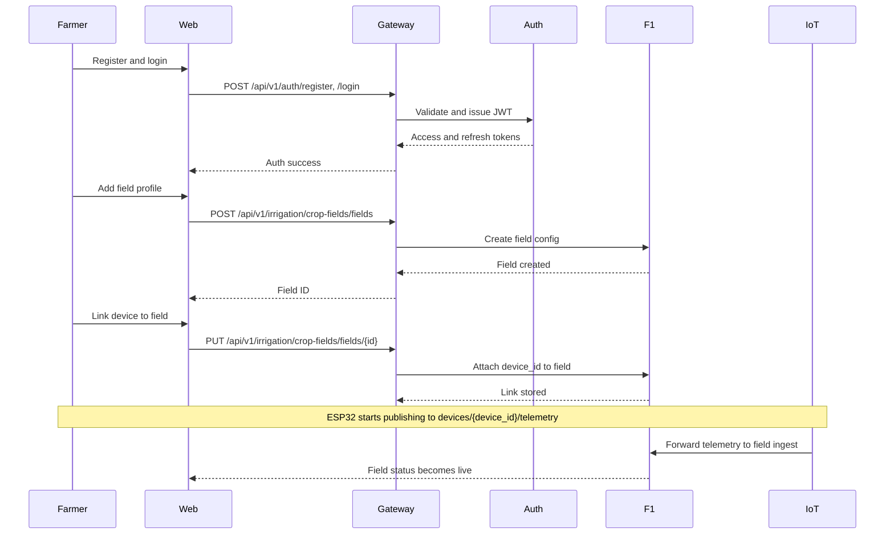
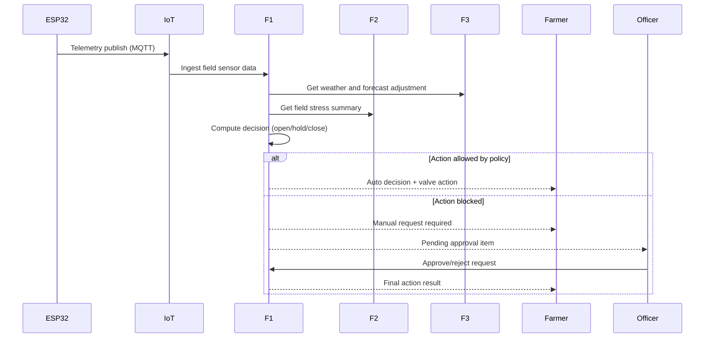
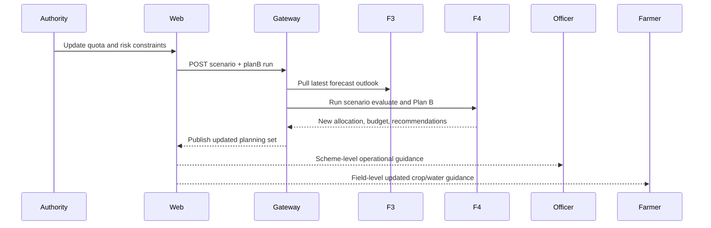
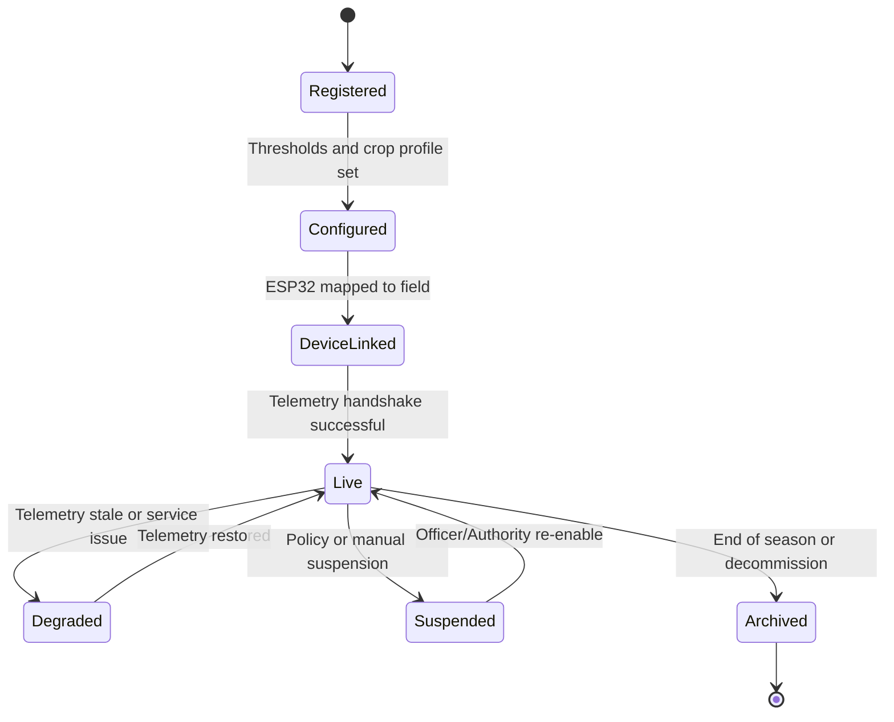
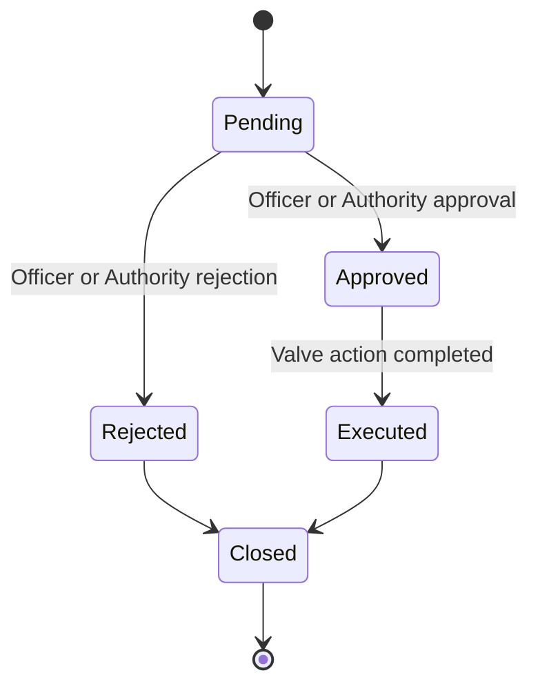
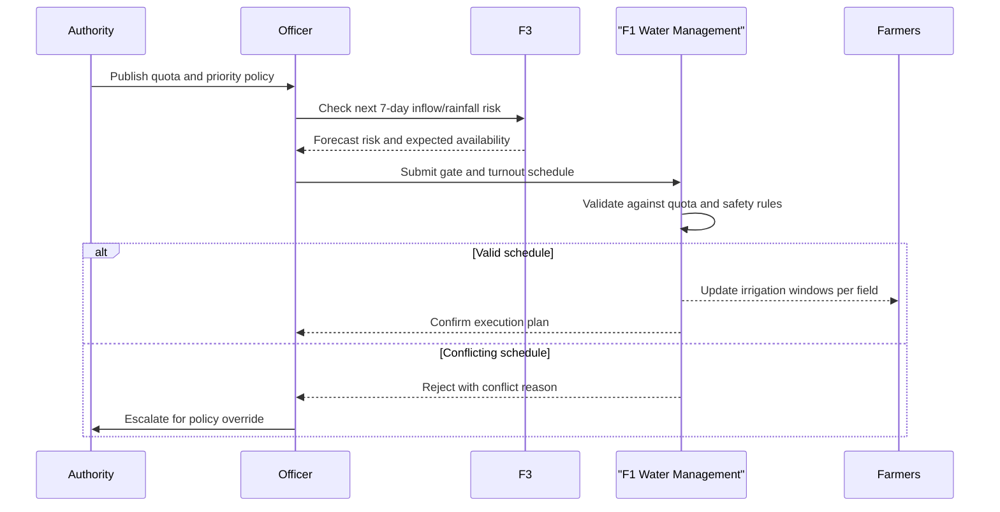
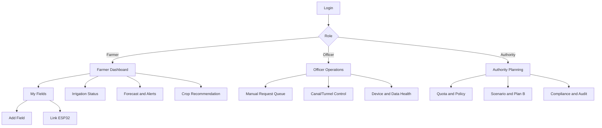

# System Redesign - Role-Based User Flows and Functional Architecture

## Document Control
- **Project:** Smart Irrigation System
- **Purpose:** Define target user journeys, functional requirements, and architecture redesign
- **Audience:** Product owners, architects, backend/frontend teams, IoT team, DevOps
- **Status:** Draft for implementation planning

---

## 1. Redesign Objective

This redesign converts the platform into a **clear role-based operational system** where:
1. Farmers can onboard fields and devices, run irrigation, and use decision support.
2. Irrigation officers can supervise command areas, approve sensitive actions, and manage service delivery.
3. Irrigation authority users can run advanced planning, quota policies, and scheme-level optimization.

The target is to make all current capabilities (F1-F4 + IoT + Auth) work as one integrated product with explicit flows and permissions.

---

## 2. User Roles (3 Role Model)

## Role A: Farmer
- Registers and logs in.
- Creates and manages own fields.
- Links ESP32 devices to fields.
- Views sensor telemetry, crop health, weather, forecast, and recommendations.
- Executes allowed irrigation actions (manual/auto within policy).

## Role B: Irrigation Officer (Department Operations)
- Oversees multiple farmers and fields within assigned scheme.
- Monitors canal/distribution and operational risk alerts.
- Reviews manual irrigation requests when auto-control blocks action.
- Manages field-to-scheme mapping and service health at operational level.

## Role C: Irrigation Authority (Advanced Planning)
- Runs advanced forecasting and optimization scenarios.
- Sets/updates seasonal water quota and policy constraints.
- Triggers plan revision (Plan B) for drought/flood or policy changes.
- Reviews scheme-level KPIs, compliance, and audit reports.

---

## 3. Access and Permission Matrix

| Capability | Farmer | Irrigation Officer | Irrigation Authority |
|---|:---:|:---:|:---:|
| Register/Login | Yes | Yes | Yes |
| Add/Edit own fields | Yes | Yes (all in scheme) | Yes |
| Link ESP32 to field | Yes (own) | Yes | Yes |
| View own telemetry | Yes | Yes | Yes |
| Issue direct valve command | Limited | Yes | Yes |
| Approve blocked manual request | No | Yes | Yes |
| View crop-health zones | Yes | Yes | Yes |
| View weather/forecast dashboards | Yes | Yes | Yes |
| Submit forecast training/admin operations | No | Limited | Yes |
| Run F4 optimization scenarios | Basic (field-level) | Yes (scheme-level) | Yes (multi-scheme) |
| Set quota/policy constraints | No | Limited | Yes |
| Run Plan B at scale | No | Limited | Yes |
| User and role administration | No | No | Yes |

---

## 4. End-to-End Functional Vision

### 4.1 Farmer Journey (Primary)
1. Farmer registers and logs in.
2. Farmer creates field profile (name, area, crop type, location, scheme).
3. Farmer links ESP32 device to field.
4. Device streams telemetry via MQTT.
5. System shows field status and auto irrigation recommendation.
6. Farmer monitors:
- F1 irrigation status
- F2 crop stress map
- F3 weather and risk
- F4 crop recommendation and water budget
7. Farmer triggers manual action if needed.
8. If blocked by policy, manual request is sent for officer approval.

### 4.2 Irrigation Officer Journey (Operational)
1. Officer logs in and opens operations dashboard.
2. Officer monitors canals, field clusters, and alert queues.
3. Officer reviews pending manual requests and approves/rejects with reason.
4. Officer checks device connectivity and data quality issues.
5. Officer coordinates corrective actions for stressed/high-risk fields.
6. Officer creates hydraulic schedules in workflow mode (`ACCEPTED`/`REJECTED`) without direct physical gate execution in this release.

### 4.3 Irrigation Authority Journey (Advanced)
1. Authority opens planning dashboard.
2. Reviews seasonal forecast and storage projections.
3. Updates water quota/policy constraints.
4. Runs optimization scenarios and Plan B.
5. Publishes updated guidance to officers and farmers.
6. Tracks outcomes and compliance metrics.

---

## 5. Functional Requirements (Use-Case Driven)

## 5.1 Identity and Access
- **FR-001:** System shall support role-based access for Farmer, Officer, and Authority.
- **FR-002:** System shall issue JWT access and refresh tokens.
- **FR-003:** System shall enforce role checks on sensitive APIs.

## 5.2 Field and Device Onboarding
- **FR-010:** Farmer shall create, view, update, and delete field profiles.
- **FR-011:** Field profile shall include area, crop type, thresholds, and location.
- **FR-012:** System shall link one or more ESP32 devices to a field (with ownership checks).
- **FR-013:** System shall validate device handshake before marking field "live".

## 5.3 Telemetry and Irrigation Operations
- **FR-020:** System shall ingest telemetry via MQTT and REST fallback.
- **FR-021:** System shall compute field status (water, soil, valve, connectivity).
- **FR-022:** System shall generate auto-irrigation decisions using forecast and stress context.
- **FR-023:** System shall allow manual override within role and policy limits.
- **FR-024:** System shall create approval requests when manual/auto action is blocked.
- **FR-025:** Officer/Authority shall approve or reject blocked requests with audit logs.

## 5.4 Crop Health and Stress
- **FR-030:** System shall run zone-based crop health analysis (F2).
- **FR-031:** System shall reject invalid analysis areas (water/urban/insufficient vegetation).
- **FR-032:** System shall expose field stress summary for cross-service decisioning.

## 5.5 Forecasting and Alerting
- **FR-040:** System shall provide weather summary and irrigation recommendation.
- **FR-041:** System shall provide forecast/risk endpoints for operational planning.
- **FR-042:** Admin-level users shall access advanced forecast training/analytics routes.

## 5.6 Optimization and Planning
- **FR-050:** System shall generate crop recommendations per field.
- **FR-051:** System shall evaluate scenario constraints (quota, risk, min paddy).
- **FR-052:** System shall generate Plan B under changed quota/market conditions.
- **FR-053:** System shall provide supply and water-budget aggregation for authority users.

## 5.7 Audit and Observability
- **FR-060:** System shall persist run artifacts for recommendations, Plan B, and supply runs.
- **FR-061:** System shall persist manual request lifecycle and decision audit events.
- **FR-062:** System shall expose service health and metrics endpoints.

---

## 6. Target Architecture (Redesign View)

---

## 7. Key Sequence Flows

## 7.1 Farmer Adds Field and Connects ESP32

## 7.2 Automated Irrigation Decision Cycle

## 7.3 Authority Plan B and Quota Update

---

## 8. Domain State Models

## 8.1 Field Lifecycle State

## 8.2 Manual Request Lifecycle

---

## 9. Canonical Functional Modules (for Implementation)

1. **Identity and Access Module**
- AuthN/AuthZ, role mapping, token lifecycle.

2. **Field Digital Twin Module**
- Field profiles, thresholds, device mappings, status state machine.

3. **Device Provisioning and Telemetry Module**
- Device registration, telemetry ingestion, command dispatch, quality checks.

4. **Irrigation Orchestration Module**
- Decision engine, policy guardrails, manual-request workflow.

5. **Agro Intelligence Module**
- Crop stress analysis (F2) + weather/forecast intelligence (F3).

6. **Planning and Optimization Module**
- F4 recommendations, scenario evaluation, Plan B, supply/water budget.

7. **Audit and Compliance Module**
- Action history, approvals, model run artifacts, accountability.

8. **Observability and Operations Module**
- Health checks, metrics, logs, traces, alert routing.

---

## 10. Proposed API Grouping (Target)

- `/api/v1/auth/*` - identity
- `/api/v1/farm/*` - field profile and ownership
- `/api/v1/devices/*` - provisioning and mapping
- `/api/v1/telemetry/*` - ingest/query telemetry
- `/api/v1/irrigation/*` - decisions, valve actions, manual requests
- `/api/v1/crop-health/*` - zone/stress/image health
- `/api/v1/forecast/*` - weather, forecast, risk
- `/api/v1/planning/*` - recommendations, scenario, plan B, supply
- `/api/v1/admin/*` - role and system administration

This keeps the UI and gateway clean and role-aware.

---

## 11. Non-Functional Requirements

- **NFR-001 Availability:** Core irrigation and telemetry APIs should degrade gracefully under partial failures.
- **NFR-002 Security:** Role-gated endpoints, token validation, audit trail for control actions.
- **NFR-003 Traceability:** Every decision and approval should be attributable by user/role/time.
- **NFR-004 Data Freshness:** UI must show source, freshness, and availability contract flags.
- **NFR-005 Scalability:** Device ingest and read APIs should scale independently from optimization workloads.
- **NFR-006 Reliability:** Manual control path must exist when ML/forecast sources are unavailable.

---

## 12. Implementation Roadmap (Recommended)

## Phase 1 - Access and Role Cleanup
- Normalize role model to Farmer, Officer, Authority.
- Standardize permission enforcement across all services.

## Phase 2 - Field and Device Unified Onboarding
- Introduce explicit field creation + device linking wizard.
- Add handshake confirmation and field lifecycle state.

## Phase 3 - Irrigation Decision Governance
- Finalize policy guardrails and manual approval workflow.
- Add officer queue and response SLAs.

## Phase 4 - Intelligence Fusion
- Stabilize F2 stress + F3 forecast integration into F1 decisions.
- Standardize fallback and strict-mode behavior.

## Phase 5 - Planning at Authority Level
- Promote F4 scenario and Plan B to authority console with publish workflow.
- Add cross-scheme comparative reporting.

## Phase 6 - Hardening
- Close config/docs drift, align compose/k8s naming, tighten observability and runbooks.

---

## 13. Acceptance Criteria

1. Farmer can complete end-to-end: register -> add field -> link ESP32 -> see live irrigation decisions.
2. Officer can approve/reject blocked manual requests and see updated field state.
3. Authority can apply quota change and publish Plan B outputs to downstream users.
4. All major UI actions show contract metadata (status, source, data availability, freshness).
5. Critical flows are traceable through logs/audit artifacts.

---

## 14. Summary

This redesign formalizes the platform as a **role-driven, flow-centric irrigation system**. It preserves all current technical functions but reorganizes them into clear operational journeys so adoption is easier, governance is stronger, and advanced planning can be safely delegated to irrigation authorities.

---

## 15. Detailed Use Scenario Catalog

| Use Case ID | Role | Scenario | Main Outcome |
|---|---|---|---|
| UC-FARM-001 | Farmer | Register and login | Farmer account created with farmer-level permissions |
| UC-FARM-002 | Farmer | Add field and crop profile | Field digital twin created with thresholds and ownership |
| UC-FARM-003 | Farmer | Connect ESP32 to field | Device handshake completed and field marked live |
| UC-FARM-004 | Farmer | Daily irrigation monitoring | Farmer sees sensor state, valve decision, forecast-adjusted recommendation |
| UC-FARM-005 | Farmer | Request blocked irrigation action | Approval request routed to officer with audit trail |
| UC-OFF-001 | Officer | Monitor scheme operation board | Officer tracks field groups, canal status, queue health, and alerts |
| UC-OFF-002 | Officer | Approve or reject farmer requests | Controlled manual action with reason and accountability |
| UC-OFF-003 | Officer | Manage canal/tunnel/channel distribution | Gate or turnout actions are coordinated with water constraints |
| UC-AUTH-001 | Authority | Set seasonal water quota and policy | System-wide constraints updated for all downstream modules |
| UC-AUTH-002 | Authority | Run scenario and publish Plan B | Updated crop/water guidance distributed to officers and farmers |
| UC-AUTH-003 | Authority | Emergency drought/flood response | Priority rules and safe operation mode activated |

### 15.1 UC-FARM-001: Farmer Registration and Login
- **Preconditions:** None.
- **Trigger:** New farmer opens registration page.
- **Main flow:**
  1. Farmer submits name, contact, password, and role=`farmer`.
  2. Auth service validates and creates account.
  3. Gateway returns JWT and refresh token.
  4. UI redirects farmer to farmer dashboard.
- **Postconditions:** Authenticated farmer session is active.

### 15.2 UC-FARM-002: Field Creation
- **Preconditions:** Farmer logged in.
- **Trigger:** Farmer clicks `Add Field`.
- **Main flow:**
  1. Farmer enters field name, area, crop type, soil parameters, location, and scheme.
  2. F1 stores field profile and policy defaults.
  3. Field state becomes `Configured` (not yet live).
- **Postconditions:** Field appears in farmer field list and is ready for device mapping.

### 15.3 UC-FARM-003: ESP32 Connection to Field
- **Preconditions:** Field is configured.
- **Trigger:** Farmer chooses `Link Device`.
- **Main flow:**
  1. Farmer enters/scans `device_id`.
  2. F1 maps `device_id` to field ownership.
  3. ESP32 publishes telemetry to MQTT topic `devices/{device_id}/telemetry`.
  4. IoT service receives telemetry and forwards it to F1 field ingest.
  5. F1 validates freshness and sensor schema.
  6. Field state changes `DeviceLinked -> Live`.
- **Postconditions:** Dashboard shows live telemetry and decision cards.

### 15.4 UC-FARM-004: Automated Irrigation Operation
- **Preconditions:** Field is live with recent telemetry.
- **Trigger:** New telemetry arrives or farmer opens field status.
- **Main flow:**
  1. F1 calculates decision inputs from sensors.
  2. F1 pulls forecast adjustment from F3 and stress factor from F2.
  3. Decision engine computes `open`, `hold`, or `close` valve action.
  4. If policy allows, action executes and is logged.
  5. Farmer sees status, reason, and expected next review time.
- **Postconditions:** Irrigation action and rationale are traceable.

### 15.5 UC-FARM-005 / UC-OFF-002: Manual Request and Review
- **Preconditions:** Auto action is blocked by policy or conflict.
- **Trigger:** Farmer presses `Request Manual Action`.
- **Main flow:**
  1. F1 creates `Pending` manual request with field snapshot.
  2. Officer queue receives notification.
  3. Officer reviews forecast, reservoir, and current gate conditions.
  4. Officer approves or rejects with reason.
  5. F1 executes approved action and writes audit event.
- **Postconditions:** Request lifecycle is completed and visible to farmer/officer.

### 15.6 UC-OFF-003: Canal, Tunnel, and Channel Distribution Control
- **Preconditions:** Officer logged in for assigned scheme.
- **Trigger:** Water demand mismatch, forecast warning, or authority instruction.
- **Main flow:**
  1. Officer opens hydraulic network view (reservoir -> main canal -> tunnel -> distributary/channel -> field turnout).
  2. Officer compares requested field demand vs available flow and policy quota.
  3. Officer schedules gate/turnout action (open, hold, close, partial).
  4. F1 water-management records command and propagates impact to field-level recommendations.
  5. Affected farmers receive updated irrigation windows.
- **Postconditions:** Distribution network and field decisions remain consistent.

### 15.7 UC-AUTH-002: Scenario and Plan B Publication
- **Preconditions:** Authority role and latest forecast data available.
- **Trigger:** Seasonal review or abnormal drought/flood signal.
- **Main flow:**
  1. Authority sets scenario parameters (quota, rainfall band, price, risk tolerance, min paddy).
  2. F4 runs cross-field optimization using F3 outlook and F1 context.
  3. Authority compares baseline vs scenario outputs.
  4. Authority publishes selected Plan B.
  5. Officer dashboards and farmer guidance update automatically.
- **Postconditions:** Active scheme guidance version is changed with full audit metadata.

---

## 16. Flow-to-Requirement Traceability

| Use Case | Functional Requirements | Primary Services | Key APIs |
|---|---|---|---|
| UC-FARM-001 | FR-001, FR-002, FR-003 | F0 Auth, Gateway | `/api/v1/auth/register`, `/api/v1/auth/login` |
| UC-FARM-002 | FR-010, FR-011 | F1, Gateway | `/api/v1/irrigation/crop-fields/fields` |
| UC-FARM-003 | FR-012, FR-013, FR-020 | F1, IoT, Gateway | `/api/v1/irrigation/crop-fields/fields/{id}`, MQTT telemetry |
| UC-FARM-004 | FR-021, FR-022, FR-040 | F1, F2, F3 | `/status`, `/auto-decision`, forecast weather APIs |
| UC-FARM-005 | FR-023, FR-024, FR-025, FR-061 | F1, Gateway | `/manual-requests`, `/manual-requests/{id}/review` |
| UC-OFF-003 | FR-053, FR-060, FR-062, FR-070, FR-071 | F1 Water Management, F3 | `/water-management/*` |
| UC-AUTH-002 | FR-041, FR-042, FR-050, FR-051, FR-052, FR-060 | F3, F4, Gateway | `/f4/recommendations/scenario-evaluate`, `/f4/recommendations/optimize` |

---

## 17. Additional Functional Requirements for Redesign

### 17.1 Hydraulic Distribution (Canal/Tunnel/Channel)
- **FR-070:** System shall maintain a digital model of reservoir, canal, tunnel, distributary/channel, turnout, and linked fields.
- **FR-071:** Officer shall schedule and execute gate/turnout actions with time window and expected flow.
- **FR-072:** System shall expose current network state (gate status, flow estimate, blocked segments, maintenance flag).
- **FR-073:** Field-level irrigation decisions shall be constrained by current upstream distribution capacity.
- **FR-074:** All gate and turnout actions shall be recorded with actor, reason, timestamp, and downstream impact.

### 17.2 Governance and Safety
- **FR-080:** Authority shall be able to activate emergency mode (`drought`, `flood`, `maintenance`) for a scheme.
- **FR-081:** Emergency mode shall enforce policy overrides on field-level auto actions.
- **FR-082:** System shall keep versioned policy sets so a previous plan can be restored quickly.

---

## 18. Hydraulic Network Control Flow

---

## 19. UI Navigation Blueprint (Role-Specific)

---

## 20. Concrete Redesign Changes to Implement

1. **Role Model Upgrade**
- Add explicit `officer` and `authority` roles in auth schemas and route guards.

2. **Unified Onboarding Wizard**
- Implement a guided flow: `Create Field -> Configure Thresholds -> Link ESP32 -> Validate Live Telemetry`.

3. **Hydraulic Network Module**
- Add canal/tunnel/channel entities and gate schedule APIs under irrigation water-management.

4. **Decision Governance Layer**
- Make all blocked auto/manual actions route through an approval queue with SLA and escalation.

5. **Scenario Publication Workflow**
- Add `draft -> review -> publish` states for Plan B outputs so authority decisions are controlled.

6. **Cross-Service Contract Hardening**
- Ensure all responses return source/freshness/status metadata for trust and debugging.

7. **Operational Readiness**
- Add monitoring dashboards for telemetry lag, approval backlog, failed gate actions, and stale forecasts.

---

## 21. Final Architecture Direction

The recommended redesign is a **three-role, policy-governed operational model** where:
- Farmers run daily field operations with high usability and clear visibility.
- Officers manage real-world delivery constraints (including canal/tunnel/channel control).
- Authorities manage long-horizon policy, quota, and Plan B optimization.

This keeps your current technical foundation (F0-F4 + IoT + gateway) but organizes it into a production-ready operating flow for real irrigation schemes.
