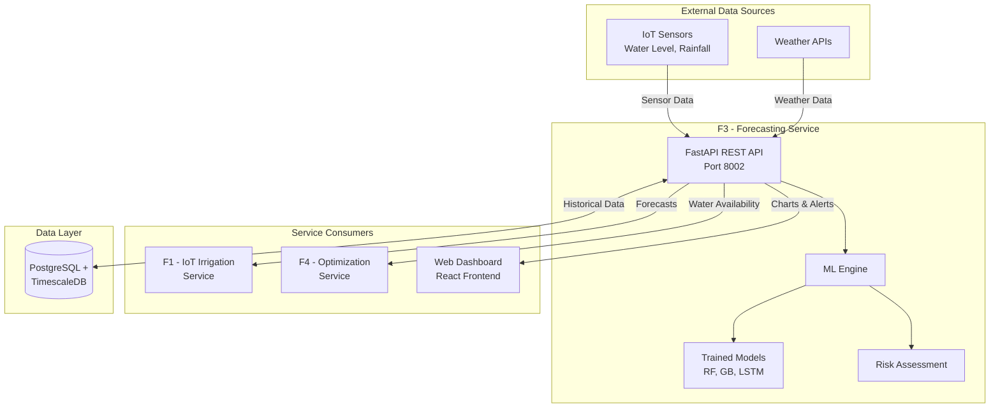
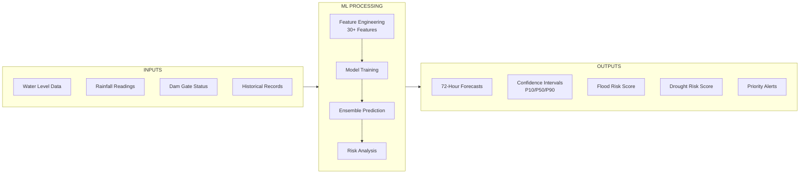
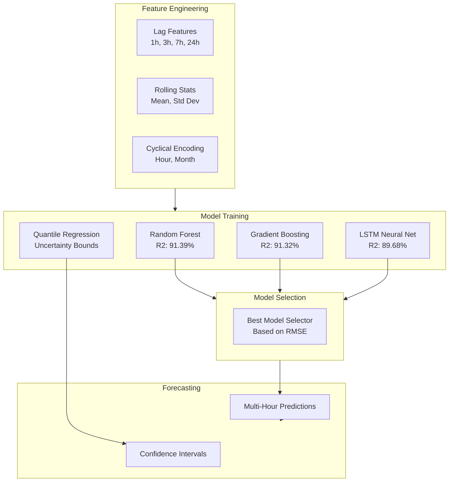
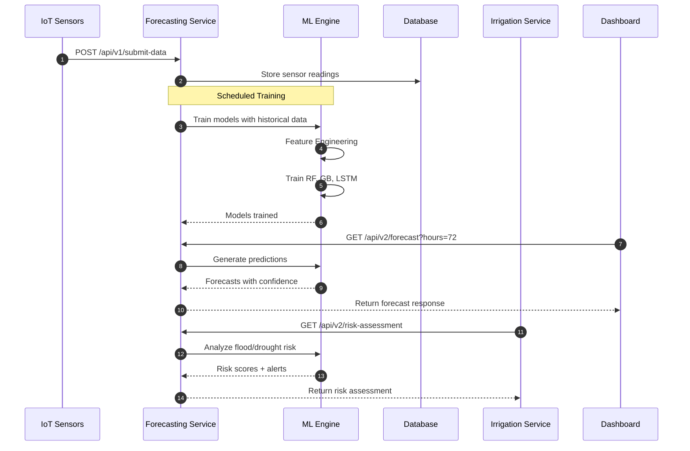
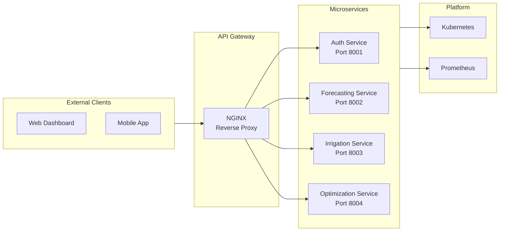

# 📊 Forecasting Service - PP1 Presentation Diagrams

> Visual diagrams for Progress Presentation 1 (PP1) - F3: ML Time-Series Forecasting & Alerting

---

## 1. System Architecture Overview

*Shows where Forecasting Service (F3) fits in the overall system*

**Key Points to Mention:**
- Central position receiving data from IoT sensors
- Feeds predictions to both Irrigation (F1) and Optimization (F4) services
- RESTful API design enables dashboard integration

---

## 2. Input → Processing → Output Flow

*Shows the data transformation pipeline*

**Key Points to Mention:**
- Multiple data sources ingested
- 30+ engineered features for ML models
- Outputs include both predictions AND uncertainty quantification

---

## 3. ML Pipeline Architecture

*Shows the machine learning model ensemble*

**Key Points to Mention:**
- Three different ML approaches for robustness
- Automatic best model selection based on performance
- Quantile regression provides uncertainty bounds (P10-P90)

---

## 4. Service Interaction Sequence

*Shows how the service handles requests*

**Key Points to Mention:**
- Asynchronous data ingestion from sensors
- RESTful API endpoints for different consumers
- Scheduled model retraining keeps predictions accurate

---

## 5. Microservices Architecture

*Shows the full platform architecture*

**Key Points to Mention:**
- Each service is independently deployable
- NGINX gateway handles routing and cross-cutting concerns
- Kubernetes orchestration enables scaling

---

## 6. Technology Stack Summary

| Layer | Technology | Purpose |
|-------|------------|---------|
| **API Framework** | FastAPI | High-performance async REST API |
| **ML - Classical** | scikit-learn | Random Forest, Gradient Boosting |
| **ML - Deep Learning** | TensorFlow/Keras | LSTM Neural Networks |
| **Data Processing** | Pandas, NumPy | Feature engineering |
| **Validation** | Pydantic | Type-safe request/response |
| **Database** | PostgreSQL + TimescaleDB | Time-series storage |
| **Container** | Docker | Containerization |
| **Orchestration** | Kubernetes | Production deployment |

---

## 7. Model Performance Comparison

| Model | R² Score | RMSE | Best For |
|-------|----------|------|----------|
| **Random Forest** | 91.39% | Low | Non-linear patterns |
| **Gradient Boosting** | 91.32% | Low | Sequential error correction |
| **LSTM** | 89.68% | Medium | Long-term temporal dependencies |

---

## 8. API Endpoints Summary

| Version | Endpoint | Description |
|---------|----------|-------------|
| v1 | `GET /api/v1/forecast` | Basic linear forecast |
| v1 | `GET /api/v1/risk-assessment` | Simple risk analysis |
| v2 | `POST /api/v2/train` | Train all ML models |
| v2 | `GET /api/v2/forecast?hours=72` | ML-based forecast with uncertainty |
| v2 | `GET /api/v2/model-comparison` | Compare model performance |
| v2 | `GET /api/v2/risk-assessment` | ML-based risk with confidence |

---

## Presentation Tips

1. **Start with Diagram 1** - Show where your service fits in the big picture
2. **Use Diagram 2** - Explain inputs → outputs simply
3. **Highlight Diagram 3** - Emphasize ML specialization with accuracy metrics
4. **Demo with Diagram 4** - Show the actual API flow
5. **End with business value** - Flood prevention, crop protection

**Time allocation:**
- 30 sec: Architecture overview
- 30 sec: Input/Output flow
- 30 sec: ML models and accuracy
- 30 sec: Demo capability + value

---

*Generated for PP1 Presentation - Smart Irrigation System Project*
