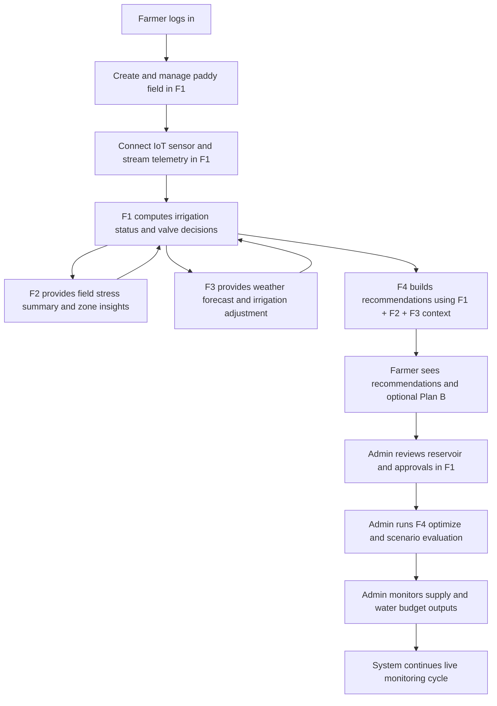

# Central Functional Development Plan (F1 + F2 + F3 + F4)

## Objective
This is the centralized development document for implementing the full Smart Irrigation functional flow with all four core functions connected:
- F1 Irrigation
- F2 Crop Health and Water Stress
- F3 Forecasting
- F4 Optimization

Use this file as the main implementation entry point.

## Canonical Function Documents
- F1 Irrigation: [docs/f1-irrigation-function/README.md](../f1-irrigation-function/README.md)
- F2 Crop Health: [docs/f2-crop-health-function/README.md](../f2-crop-health-function/README.md)
- F3 Forecasting: [docs/f3-forecasting-function/README.md](../f3-forecasting-function/README.md)
- F4 Optimize: [docs/f4-optimize-function/README.md](../f4-optimize-function/README.md)

## End-to-End Functional Order


## Unified Paddy Field Profile (Single Screen Requirement)
When the user opens one paddy field profile, show integrated data from all four functions:

| Profile Section | Function Source | Primary Endpoint(s) | Purpose |
|---|---|---|---|
| Unified aggregate (all sections) | Gateway | `GET /api/v1/irrigation/fields/{field_id}/profile` | One response with F1/F2/F3/F4 + partial-failure metadata |
| Field setup and sensor status | F1 | `GET /api/v1/irrigation/crop-fields/fields/{field_id}/status` | Field metadata, sensor connectivity, water level, soil moisture |
| Auto and manual irrigation actions | F1 | `GET /api/v1/irrigation/crop-fields/fields/{field_id}/auto-decision`, `POST /api/v1/irrigation/crop-fields/fields/{field_id}/valve` | OPEN/CLOSE/HOLD decision and manual override path |
| Manual request workflow | F1 | `POST /api/v1/irrigation/crop-fields/fields/{field_id}/manual-requests`, `GET /api/v1/irrigation/crop-fields/manual-requests`, `POST /api/v1/irrigation/crop-fields/manual-requests/{request_id}/review` | Farmer request + admin review/approval audit |
| Crop stress summary | F2 | `GET /api/v1/crop-health/fields/{field_id}/stress-summary` | Stress index, priority, penalty factor for planning |
| Weather and irrigation forecast | F3 | `GET /api/v1/forecast/weather/summary`, `GET /api/v1/forecast/weather/irrigation-recommendation` | 7-day weather and irrigation adjustment guidance |
| Crop recommendations | F4 | `GET /api/v1/optimization/recommendations?field_id={field_id}` | Per-field ranked crop options |
| Mid-season replan | F4 | `POST /api/v1/optimization/planb` | Re-plan under new water quota or prices |
| Cross-field optimize and scenario | F4 | `POST /api/v1/optimization/recommendations/optimize`, `POST /api/v1/optimization/recommendations/scenario-evaluate` | Portfolio-level decisions for admin |

## Cross-Service Integration Contracts
Standard response status fields to align across services:
- `status` (`ok|stale|data_unavailable|analysis_pending|source_unavailable`)
- `source`
- `is_live`
- `observed_at`
- `staleness_sec`
- `quality`
- `data_available`
- `message`

Event integrations:
- F2 emits `events/crop.stress.v1`
- F4 emits `events/optimization.recommendation.v1`
- F1 emits `events/irrigation.manual_request.v1` and `events/irrigation.manual_request.reviewed.v1`

## Security and Roles (Current)
- Admin-only: `POST /api/v1/irrigation/crop-fields/fields/{field_id}/valve`
- Admin-only: `GET /api/v1/irrigation/crop-fields/manual-requests`
- Admin-only: `POST /api/v1/irrigation/crop-fields/manual-requests/{request_id}/review`
- Admin-only: `POST /api/v1/irrigation/water-management/reservoir/ingest`
- Admin-only: `/api/v1/irrigation/water-management/manual-override*`
- Authenticated farmer/admin: `POST /api/v1/irrigation/crop-fields/fields/{field_id}/manual-requests`

## Unified Profile Response Examples

### Normal (all sources available)
```json
{
  "field_id": "field-rice-01",
  "status": "ok",
  "source": "gateway_profile",
  "is_live": true,
  "data_available": true,
  "partial_failure": false,
  "sections": {
    "f1": { "status": "ok", "data_available": true },
    "f2": { "status": "ok", "data_available": true },
    "f3": { "status": "ok", "data_available": true },
    "f4": { "status": "ok", "data_available": true }
  }
}
```

### Stale (some sections available, not fully live)
```json
{
  "field_id": "field-rice-01",
  "status": "stale",
  "source": "gateway_profile",
  "is_live": false,
  "data_available": true,
  "partial_failure": false,
  "sections": {
    "f1": { "status": "ok", "data_available": true },
    "f2": { "status": "stale", "data_available": true, "message": "Artifact is old" },
    "f3": { "status": "ok", "data_available": true },
    "f4": { "status": "ok", "data_available": true }
  }
}
```

### Partial Failure (dependency unavailable)
```json
{
  "field_id": "field-rice-01",
  "status": "stale",
  "source": "gateway_profile",
  "is_live": false,
  "data_available": true,
  "partial_failure": true,
  "errors": [
    "crop_health returned 503: analysis artifact unavailable"
  ],
  "sections": {
    "f1": { "status": "ok", "data_available": true },
    "f2": { "status": "source_unavailable", "data_available": false },
    "f3": { "status": "ok", "data_available": true },
    "f4": { "status": "ok", "data_available": true }
  }
}
```

## Implementation Plan

### Phase 1 - Contract and Data Alignment
1. Freeze common response contract fields for F1, F2, F3, F4.
2. Confirm shared identifiers: `field_id`, `season`, `scheme_id`, `device_id`.
3. Align strict mode handling and fallback behavior definitions.
4. Publish contract examples in each service README.

### Phase 2 - Backend Integration Order
1. Complete F1 field lifecycle and sensor telemetry reliability.
2. Integrate F2 stress-summary read path into F1 and F4 dependency calls.
3. Integrate F3 weather and irrigation recommendation into F1 and F4.
4. Confirm F4 feature builder reads F1/F2/F3 live contexts correctly.
5. Validate event publishing and broker routing for F2 and F4 events.

### Phase 3 - Unified Field Profile API Layer
1. Implement a gateway aggregation endpoint for one field profile.
2. Aggregate F1 status, F2 stress, F3 forecast, and F4 recommendation payloads.
3. Return partial payloads when one source is unavailable.
4. Expose freshness metadata for each section in the profile response.

### Phase 4 - Frontend Integration
1. Build one paddy field profile page that renders all four function blocks.
2. Add farmer actions: manual valve, refresh forecast, request recommendation, Plan B.
3. Add admin actions: reservoir review, optimize, scenario evaluate, supply monitor.
4. Add error-state UI for source unavailable and analysis pending states.

### Phase 5 - Testing and Quality Gates
1. Integration tests for F1 <-> F2 <-> F3 <-> F4 dependencies.
2. Contract tests for standardized status and metadata fields.
3. End-to-end tests for farmer flow and admin flow.
4. Failure-path tests for strict mode and missing source conditions.
5. Event-driven tests for MQTT publication and downstream consumption.

### Phase 6 - Rollout
1. Deploy by dependency order: F3 and F2, then F1, then F4, then gateway/web.
2. Enable monitoring dashboards for per-service readiness and latency.
3. Run staged rollout with sample fields and admin validation.
4. Promote to production after passing acceptance checklist.

## Service Development Work Queue
1. F1: stabilize telemetry ingestion, auto decision reliability, manual request path.
2. F2: finalize stress summary artifact strategy and validation thresholds.
3. F3: harden forecast availability and irrigation recommendation contract.
4. F4: tune optimization constraints and scenario evaluation behavior.
5. Gateway/Web: deliver unified paddy field profile and role-based actions.

## Development Start Checklist
1. Read the four function READMEs linked above.
2. Implement Phase 1 contract alignment first.
3. Execute backend integration in Phase 2 order.
4. Build unified field profile aggregation endpoint.
5. Connect UI and complete end-to-end tests.

## Definition of Done
1. One paddy field profile can display F1, F2, F3, and F4 data together.
2. Farmer can complete core actions without switching services manually.
3. Admin can run optimize and scenario flows with valid cross-service context.
4. Partial failure handling is visible and actionable.
5. Integration tests pass for normal and failure scenarios.
