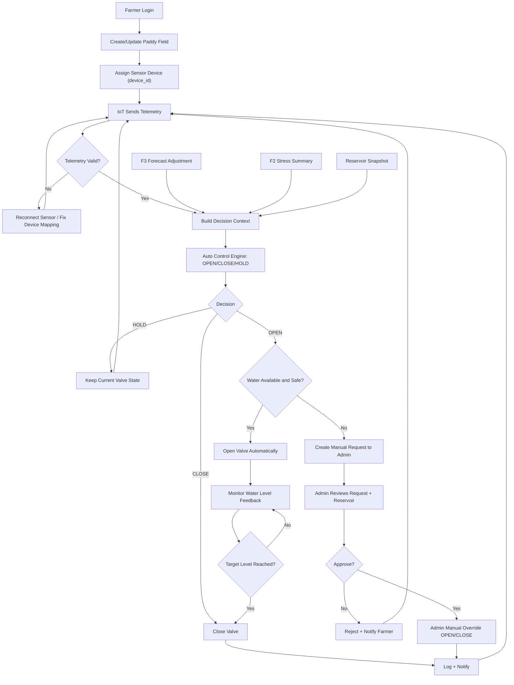
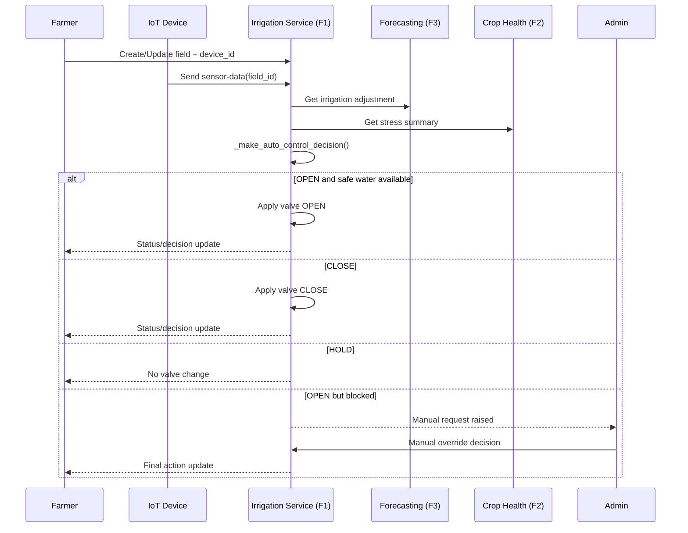

# F1 Irrigation Function - Paddy Field Functional Flow

## Scope
Main function flow for:
- Farmer paddy field setup
- IoT sensor connection and reconnection
- ML-driven automatic valve control
- Manual request path to Admin
- Admin reservoir and override operations

## Core Functions and Endpoints
| Area | Main Function/Endpoint | Purpose |
|---|---|---|
| Field setup | `POST /api/v1/irrigation/crop-fields/fields` | Create paddy field configuration |
| Sensor mapping | `PUT /api/v1/irrigation/crop-fields/fields/{field_id}` | Attach/update `device_id` |
| Device resolve | `GET /api/v1/irrigation/crop-fields/devices/{device_id}/resolve` | Map IoT device to field |
| Live ingest | `POST /api/v1/irrigation/crop-fields/fields/{field_id}/sensor-data` | Receive live sensor telemetry |
| Auto decision | `_make_auto_control_decision()` | Decide `OPEN/CLOSE/HOLD` |
| Field status | `GET /api/v1/irrigation/crop-fields/fields/{field_id}/status` | Farmer monitoring view |
| Decision preview | `GET /api/v1/irrigation/crop-fields/fields/{field_id}/auto-decision` | Show current engine decision |
| Manual valve | `POST /api/v1/irrigation/crop-fields/fields/{field_id}/valve` | Manual field-level valve action |
| Farmer manual request | `POST /api/v1/irrigation/crop-fields/fields/{field_id}/manual-requests` | Raise request when auto-open is blocked or manual intervention is needed |
| Admin request list | `GET /api/v1/irrigation/crop-fields/manual-requests` | View pending/reviewed manual requests |
| Admin request review | `POST /api/v1/irrigation/crop-fields/manual-requests/{request_id}/review` | Approve or reject with audit trail |
| Reservoir current | `GET /api/v1/irrigation/water-management/reservoir/current` | Admin reservoir check |
| Reservoir ingest | `POST /api/v1/irrigation/water-management/reservoir/ingest` | Push live reservoir snapshot |
| Water recommendation | `GET /api/v1/irrigation/water-management/recommend/auto` | ML recommendation from current data |
| Admin override | `POST /api/v1/irrigation/water-management/manual-override` | Emergency/manual control |

## Persistence
- All Function 1 runtime data is persisted in PostgreSQL via `DATABASE_URL` in `.env`.
- Runtime tables:
  - `irrigation_crop_fields`
  - `irrigation_valve_states`
  - `irrigation_sensor_readings`
  - `irrigation_reservoir_snapshots`
  - `irrigation_manual_requests`
  - `irrigation_manual_request_audit`
  - `irrigation_water_management_state`

## Role Guarding
- Admin-only:
  - `POST /api/v1/irrigation/crop-fields/fields/{field_id}/valve`
  - `GET /api/v1/irrigation/crop-fields/manual-requests`
  - `POST /api/v1/irrigation/crop-fields/manual-requests/{request_id}/review`
  - `POST /api/v1/irrigation/water-management/reservoir/ingest`
  - `POST /api/v1/irrigation/water-management/manual-override`
  - `POST /api/v1/irrigation/water-management/manual-override/cancel`
  - `GET /api/v1/irrigation/water-management/manual-override/status`
- Authenticated users (farmer/admin):
  - `POST /api/v1/irrigation/crop-fields/fields/{field_id}/manual-requests`

## Use Case Flow (Main)
1. Farmer logs in.
2. Farmer creates paddy field and assigns `device_id`.
3. IoT device sends water level and soil moisture data.
4. System validates telemetry and resolves device-to-field.
5. Decision engine loads context:
   - field thresholds
   - F3 forecast adjustment
   - F2 crop-stress summary
   - reservoir safety context
6. ML/rule engine decides `OPEN`, `CLOSE`, or `HOLD`.
7. If auto action is feasible, valve state is updated and event is logged.
8. If auto action is blocked (no safe/available water or issue), manual request is raised to Admin.
9. Admin reviews reservoir status and request.
10. Admin approves/rejects manual action or sets override.
11. System logs result and continues monitoring loop.

## F1 Contract Notes
F1 status/decision responses align to the shared contract fields:
- `status`
- `source`
- `is_live`
- `observed_at`
- `staleness_sec`
- `quality`
- `data_available`
- `message`

Blocked auto-open decisions include:
- `manual_request_required`
- `manual_request_id`
- `manual_request_status`
- `manual_request_reason`

## Activity Diagram (ML + Manual Path)

## Sequence (Roles and Services)

## Where to Modify Logic
- Field decision logic: `services/irrigation_service/app/api/crop_fields.py` (`_make_auto_control_decision`)
- Auto action execution on ingest: `services/irrigation_service/app/api/crop_fields.py` (`receive_sensor_data`)
- Reservoir-driven admin control: `services/irrigation_service/app/api/water_management.py`
- IoT to F1 bridge path: `services/iot_service/app/iot/service.py` (`_forward_to_irrigation`)
