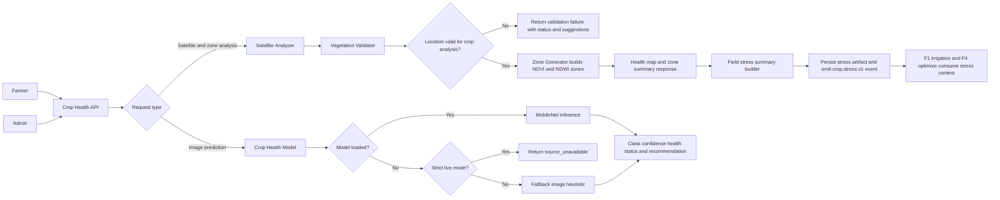
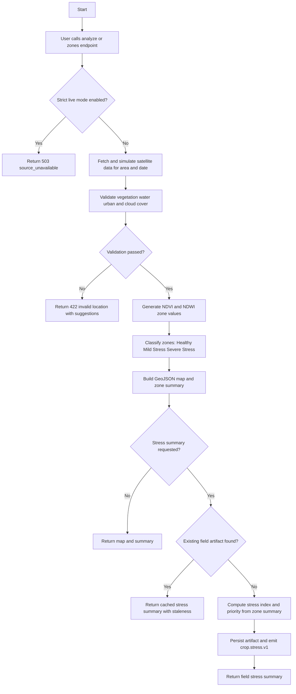
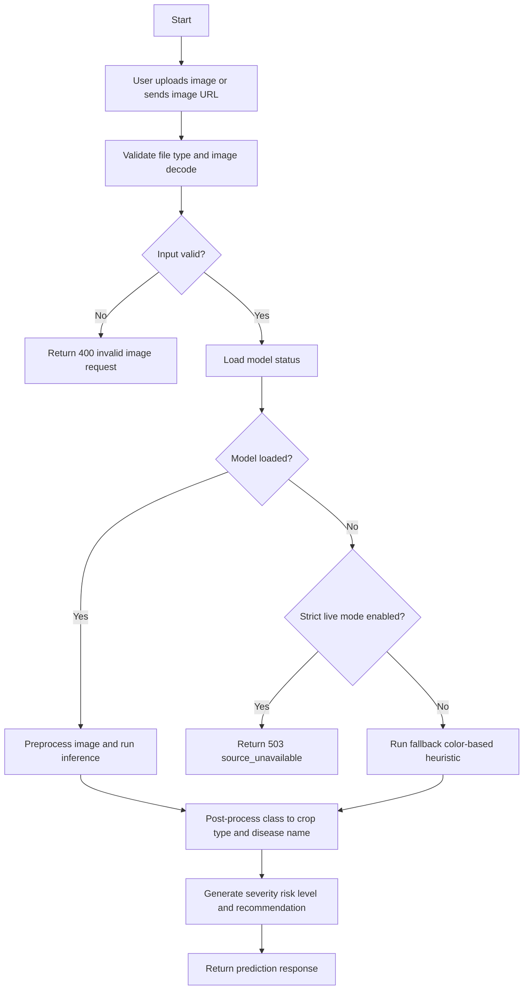
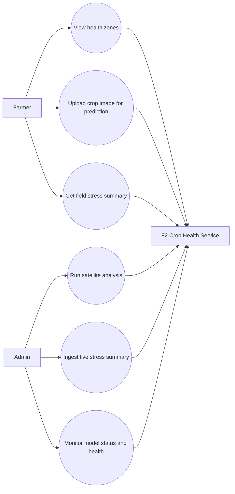

# F2 Crop Health Function - Functional Flow and Diagrams

## Scope
This document defines the Crop Health and Water Stress function (F2) flow for:
- Satellite-based health and stress zone analysis
- Image-based crop health prediction
- Field stress summary integration for downstream services

## Core Functions and Endpoints
| Area | Main Function/Endpoint | Purpose |
|---|---|---|
| Satellite analysis | `POST /api/v1/crop-health/analyze` | Run area-based analysis with validation and zone generation |
| Zone map | `GET /api/v1/crop-health/zones` | Get map-ready zone output for a location |
| Zone GeoJSON | `GET /api/v1/crop-health/zones/geojson` | Get pure GeoJSON zone collection |
| Zone summary | `GET /api/v1/crop-health/zones/summary` | Get aggregate zone statistics |
| Field stress summary | `GET /api/v1/crop-health/fields/{field_id}/stress-summary` | Get stress index, priority, and penalty factor |
| Stress summary ingest | `POST /api/v1/crop-health/fields/{field_id}/stress-summary/ingest` | Ingest externally computed live stress summary |
| Image prediction upload | `POST /api/v1/crop-health/predict` | Predict crop health from uploaded image |
| Image prediction URL | `POST /api/v1/crop-health/predict/url` | Predict crop health from image URL |
| Model status | `GET /api/v1/crop-health/model/status` | Check model readiness and contract metadata |

## Use Cases - Farmer
1. View zone-based crop health map for the selected area.
2. Upload a field image to detect crop disease or stress.
3. Check field-level stress summary and recommended action.
4. Re-run analysis for different locations or dates when validation fails.

## Use Cases - Admin
1. Run satellite health analysis for operational monitoring.
2. Review validation failures for cloud, water body, urban, or low vegetation conditions.
3. Ingest live field stress summaries from external analytics pipelines.
4. Verify model status and service readiness.
5. Use stress outputs for F1 irrigation and F4 optimization coordination.

## Security and Roles
- Admin-only: `POST /api/v1/crop-health/fields/{field_id}/stress-summary/ingest`
- Farmer/Admin: read-only F2 routes (`analyze`, `zones`, `summary`, `stress-summary`, prediction routes)

## Contract Fields
F2 stress and prediction responses align with cross-service contract fields:
- `status`
- `source`
- `is_live`
- `observed_at`
- `staleness_sec`
- `quality`
- `data_available`
- `message`

## Function Diagram

## Activity Diagram 1 - Satellite, Zones, Stress Summary

## Activity Diagram 2 - Image Prediction

## Use Case Diagram - Farmer and Admin

## Main Function Connections
1. `health_analysis.py` orchestrates satellite analysis, zone retrieval, and field stress summary APIs.
2. `satellite_analyzer.py` handles validation-first analysis workflow and zone data generation.
3. `vegetation_validator.py` enforces quality gates for vegetation, cloud cover, water, and urban rejection.
4. `zone_generator.py` creates map zones and risk classifications from NDVI and NDWI.
5. `prediction.py` handles image upload or URL prediction with strict-mode behavior.
6. `crop_health_model.py` provides ML inference and fallback heuristics with recommendation generation.

## Where to Modify Logic
- API route orchestration: `services/crop_health_and_water_stress_detection/app/api/routes/health_analysis.py`
- Prediction endpoints: `services/crop_health_and_water_stress_detection/app/api/routes/prediction.py`
- Satellite analysis pipeline: `services/crop_health_and_water_stress_detection/app/services/satellite_analyzer.py`
- Vegetation validation thresholds: `services/crop_health_and_water_stress_detection/app/services/vegetation_validator.py`
- Zone classification logic: `services/crop_health_and_water_stress_detection/app/services/zone_generator.py`
- ML inference and fallback behavior: `services/crop_health_and_water_stress_detection/app/models/crop_health_model.py`
