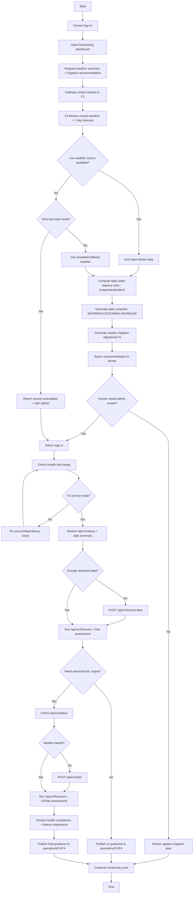

# F3 Forecasting Function - Functional Flow and Use Cases

## Scope
This document defines the Forecasting Service (F3) flow for:
- Farmer forecast consumption
- Admin operational control
- v1 baseline and v2 advanced ML usage

## Activity Diagram (Vertical)

## Use Cases - Farmer
1. Login and open forecast dashboard.
2. View weather summary for current conditions.
3. View 7-day irrigation recommendation and daily schedule.
4. Apply recommendation to paddy field operations.
5. Escalate to admin when recommendation/source is unavailable or uncertain.

## Use Cases - Admin
1. Verify service health and readiness.
2. Review forecasting data availability and data quality.
3. Submit missing observations to restore baseline forecasting.
4. Run v1 forecast and risk assessment for immediate operations.
5. Train/retrain v2 models and run advanced forecast/risk.
6. Review model comparison and feature importance.
7. Publish final guidance to dependent services (F1 irrigation, F4 optimization).

## Endpoint Map for the Flow
- Farmer-facing:
  - `GET /api/v1/forecast/weather/summary`
  - `GET /api/v1/forecast/weather/irrigation-recommendation`
  - `GET /api/v1/forecast/weather/forecast`
- Admin baseline (v1):
  - `GET /api/v1/forecast/health`
  - `GET /api/v1/forecast/ready`
  - `GET /api/v1/forecast/status`
  - `POST /api/v1/forecast/submit-data`
  - `GET /api/v1/forecast/forecast`
  - `GET /api/v1/forecast/risk-assessment`
- Admin advanced (v2):
  - `GET /api/v1/forecast/v2/status`
  - `POST /api/v1/forecast/v2/train`
  - `GET /api/v1/forecast/v2/forecast`
  - `GET /api/v1/forecast/v2/risk-assessment`
  - `GET /api/v1/forecast/v2/model-comparison`
  - `GET /api/v1/forecast/v2/feature-importance`
