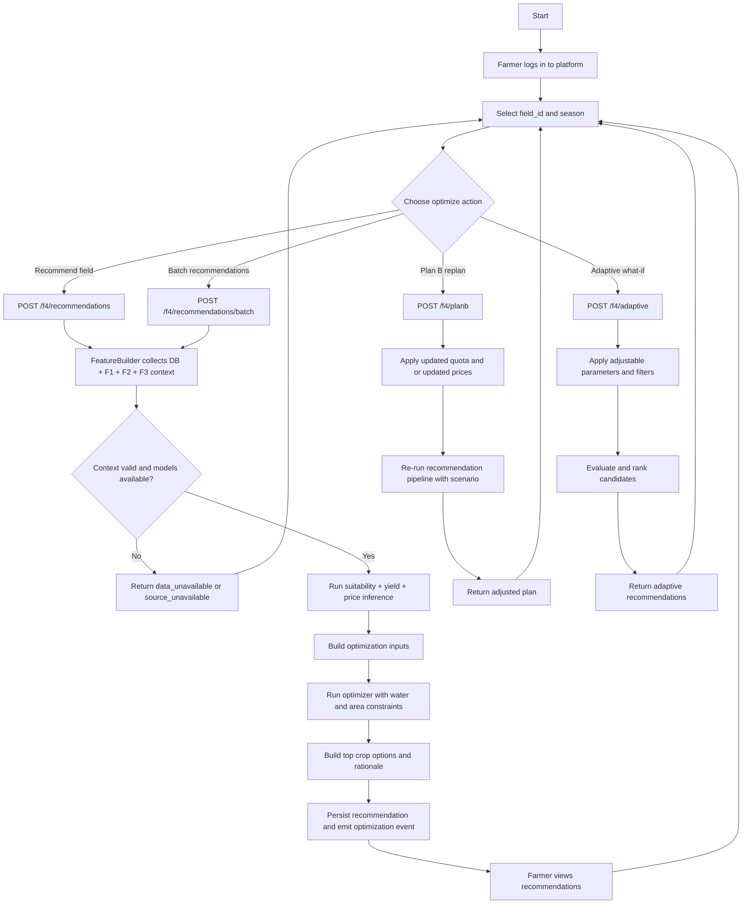
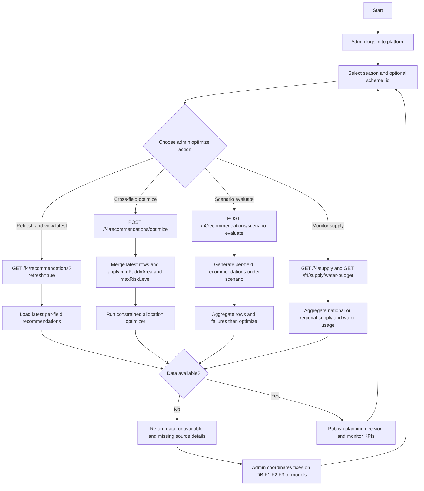
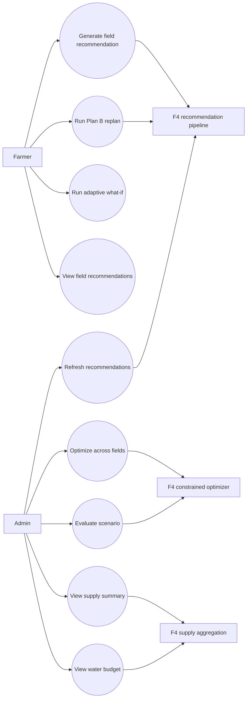

# F4 Optimize Function - Functional Flow and Use Cases

## Scope
This document defines the Optimize Service (F4) flow for:
- Farmer crop recommendation and re-planning actions
- Admin optimization, scenario planning, and supply monitoring actions
- End-to-end optimization pipeline behavior with upstream dependencies

## Core Functions and Endpoints
| Area | Main Function/Endpoint | Purpose |
|---|---|---|
| Field recommendation | `POST /f4/recommendations` | Generate crop recommendations for one field |
| Batch recommendation | `POST /f4/recommendations/batch` | Generate recommendations for multiple fields |
| Latest recommendations | `GET /f4/recommendations` | List latest saved per-field recommendations |
| Cross-field optimize | `POST /f4/recommendations/optimize` | Optimize allocation with water/area constraints |
| Scenario evaluation | `POST /f4/recommendations/scenario-evaluate` | Run backend what-if optimization over selected fields |
| Mid-season Plan B | `POST /f4/planb` | Recompute recommendations with updated quota/prices |
| Adaptive what-if | `POST /f4/adaptive` | Parameter-driven recommendation and ranking analysis |
| National/regional supply | `GET /f4/supply` | Aggregate expected supply across fields |
| Water budget summary | `GET /f4/supply/water-budget` | Aggregate crop-wise water usage summary |

## Use Cases - Farmer
1. Login and request crop recommendations for a selected field and season.
2. Request recommendations for multiple fields in a single action.
3. Run Plan B when quota or market price changes mid-season.
4. Run adaptive what-if analysis by adjusting field/weather/water/market parameters.
5. View latest recommendations and track whether data is available.

## Use Cases - Admin
1. Refresh and monitor latest recommendation availability across fields.
2. Run cross-field optimization with water quota and risk constraints.
3. Run scenario evaluation for custom what-if planning across selected fields.
4. Review failures and unavailable contexts when strict live data blocks results.
5. Monitor national/regional supply and crop-level water budget outputs.

## Activity Diagram - Farmer Optimize Flow

## Activity Diagram - Admin Optimize Flow

## Use Case Diagram - Farmer and Admin

## Main Function Connections
1. `routes_recommendations.py` handles recommendation generation, optimization, and scenario evaluation APIs.
2. `recommendation_service.py` orchestrates feature building, scoring, ML predictions, optimization, persistence, and event emit.
3. `feature_builder.py` integrates field DB data with F1 irrigation, F2 stress, and F3 forecasting contexts.
4. `optimizer.py` and `constraints.py` execute constrained allocation using greedy by default and optional LP path.
5. `planb_service.py` performs mid-season re-planning by forwarding scenario changes into the recommendation pipeline.
6. `supply_service.py` aggregates recommendation outputs for national/regional supply and water-budget reporting.

## Where to Modify Logic
- Recommendation API flow: `services/optimize_service/app/api/routes_recommendations.py`
- Core optimization pipeline: `services/optimize_service/app/services/recommendation_service.py`
- Upstream context integration: `services/optimize_service/app/features/feature_builder.py`
- Allocation logic and constraints: `services/optimize_service/app/optimization/optimizer.py`
- Constraint model and validation: `services/optimize_service/app/optimization/constraints.py`
- Plan B flow: `services/optimize_service/app/services/planb_service.py`
- Supply and water-budget aggregation: `services/optimize_service/app/services/supply_service.py`
